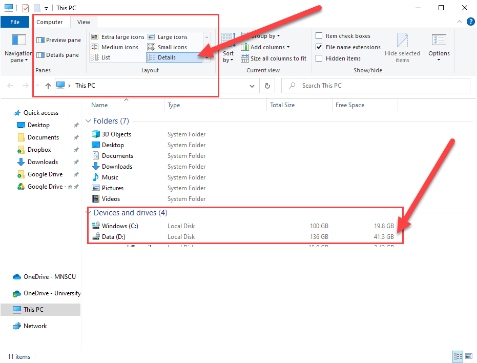
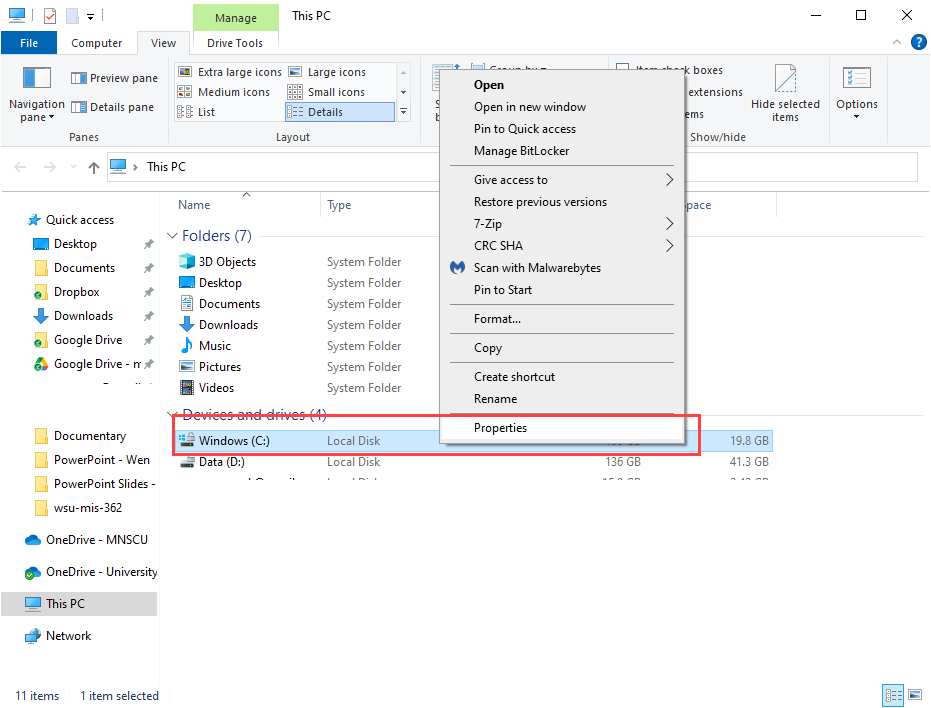
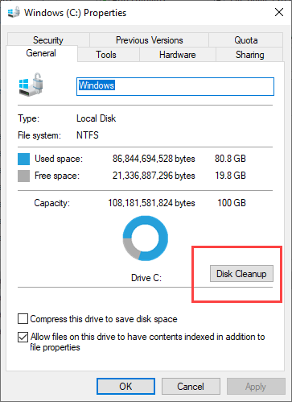
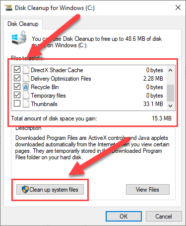
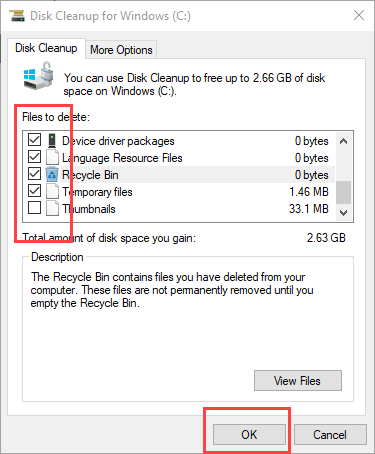
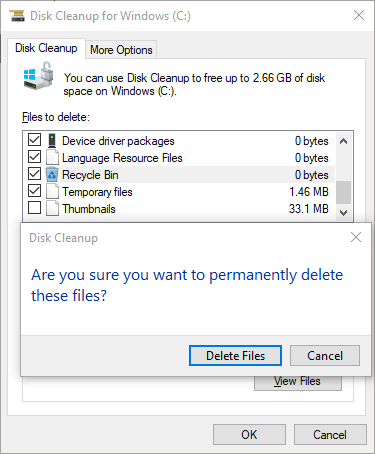
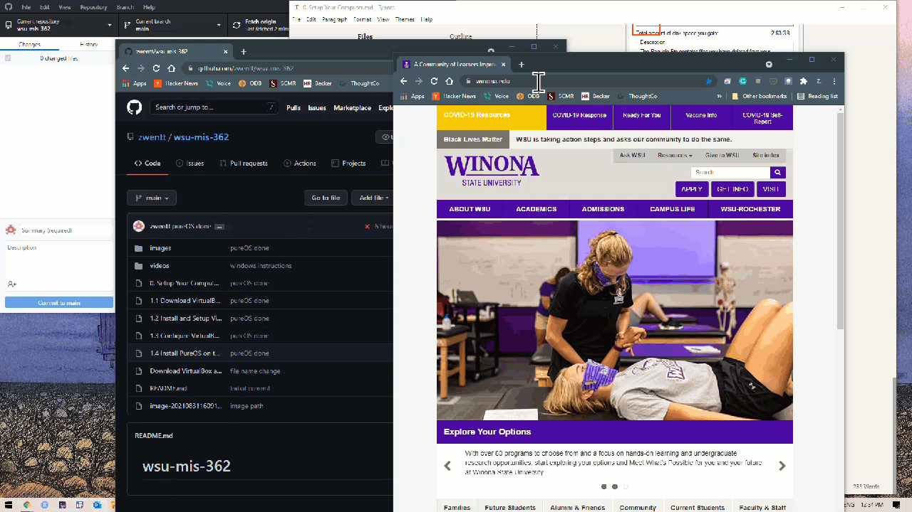

# Setup Your Computer 

## Check Free Space 

Let's first check to see how much storage space your computer has at this point. Press `Win + E` key combination (hold the `Win` key, then press `E` key) to open the file explorer. In the `View` tab, select `Details` view, then, you will get to see the storage space in the main view. In my case, I have two storage partition. I don't have enough storage in `C` drive, so I may need to use `D` drive. If you have less than `15 GB` storage space, we should free up the storage space before proceed. 

## Free Up Disk Space 

Assuming that you did not store large number of big files (e.g., movies, games, videos, million photos, etc.), this step should help you free up some spaces, especially if you have not done this since you received your computer. 

Step 1. Right click the drive you would like to clean (Usually `C` Drive). Select `Properties` .  

Step 2. Select `Disk Cleanup` .

Step 3. Select everything except `Thumbnails`. Then click `Clean up system files`, 

Step 4. In this dialog box, also select everything except `Thumbnails`. Then, click `OK`. 

Step 5. Confirm it. Once completed, you can go back to step 1 to see how much space is available now. 

## Show Two Documents in One Screen Side-by-Side

Click the title bar of the first window and drag it all the way to the right. Then, it will snap into the right hand side of the screen. It will also you to choose which Window to display next to it. 

