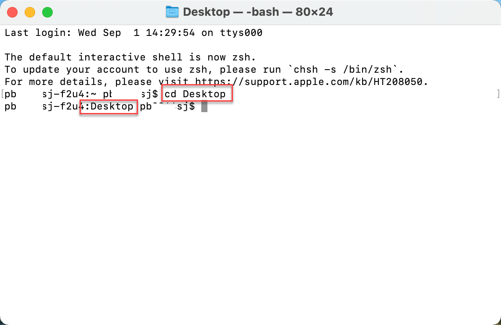

# Download VirtualBox & Pure OS

## 1. Download VirtualBox

Go to the following URL and download a VirtualBox software. 

[https://www.virtualbox.org/wiki/Downloads](https://www.virtualbox.org/wiki/Downloads)

Please download based on the type of computer you are using. For example, macOS users should download "OS X hosts" option.

## 2. Download Pure OS

Next, go to the following URL to download Pure OS. Download the "Stable" version. There is no macOS and Windows distinction for this download. 

[https://pureos.net/download/](https://pureos.net/download/)

## 3. Obtain SHA256 Information

Notice that both download websites provide `SHA256 checksums` or `SHA256SUM` . Those are long strings of text that seem to have no meaning. But those are important for the security reasons. We can verify whether we have downloaded the files we intended to download by checking the hash values against what is provided by the provider. In other words, we should be able to re-produce the hash value on our end, if the file is indeed what the provider says he/she is providing. 

For `VirtualBox` software, you can see the SHA256 through the link below. The web page will contain a list hash values for all the downloadable files. You must find out the one that matches with your file. Copy the value somewhere else. 

For `Pure OS`, the `SHA256` is provided through a file which can only be opened using a NotePad.  

### Windows Users 

Once the file is download, then drop the file into the NotePad program. 

### Mac Users 

To simplify this, you can change the file extensions to `.txt`, then double click to open the file. To change file name, highlight the file first, then hit `Enter` key. 

*Before proceed, make sure all SHA256 values are identified.* In my case, SHA256 for VirtualBox is 

`eed44e66d898c17cae46a14dff1fc86ac5c321372a7fc46efcef454c1e454307 `

The SHA256 for Pure OS is (I am using a Windows computer.)

`041466fba2e1b7cfca576d003e9553490d541653d84d29dfb5adba957fffe88e` 

## 4. Generate Hash Values for Each File

### Windows Users

**Step 1.** Using the file explorer, go to the folder where the files are downloaded (or saved). And type `cmd` in the address bar. Then, hit the `Enter` key. 

**Step 2.**  Use the `dir` command to list all the files in the folder. Please visually confirm whether the target files are in the list. `dir` means "show what is in the directory."

**Step 3.** Use the following command to generate the hash value. 

`CertUtil -hashfile "file_name" SHA256` 

Use the target file name in place of "file_name" in the command above. `SHA256` is the algorithm that is being used to generate the hash value in this case. There are other types of hash algorithms, for example, `MD5`, `SHA1`, `SHA128`, `SHA512`, etc. 

**Step 4.** Whatever values you are getting should be identical to the values you have obtained in the previous ***3. Obtain SHA256 Information*** section. 

### macOS Users

**Step 1.** For the convenience, please move both files to the `Desktop` folder. Then, open the `Terminal` app from your application list. Confirm whether the current category is under your StarID. 

**Step 2.** You can type `ls` (note: list files)to see what is in the directory. But most importantly, you need to move to the `Desktop` folder where the files are stored.  To do that, type `cd Desktop` (note: meaning, change directory to Desktop. Also, the commands are case sensitive, so you cannot use `cd desktop` or `CD DESKTOP` .)

**Step 3.** You can also type `ls` to see if files are in the directory. Type the following command to see the hash values. `shasum -a 256 file_name`  You need to supply the actual file names in place of `file_name` . (Note: since the file name is long, you can copy the file name after `ls` , then paste it in place of `file_name`.)

