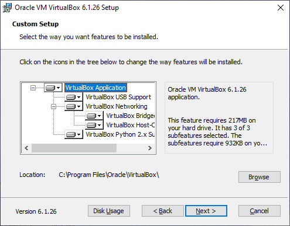
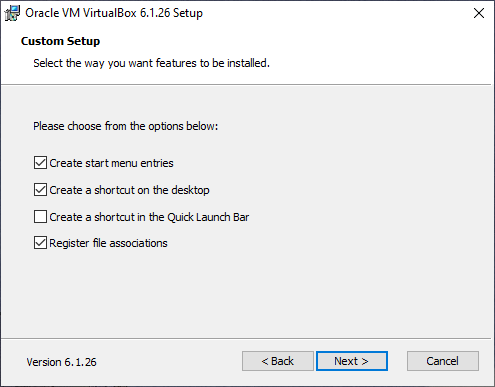
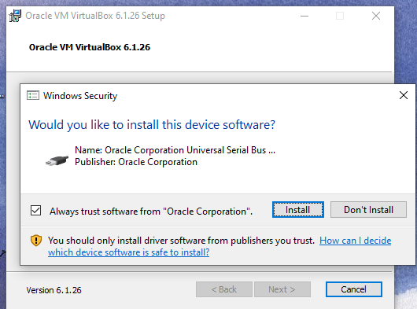
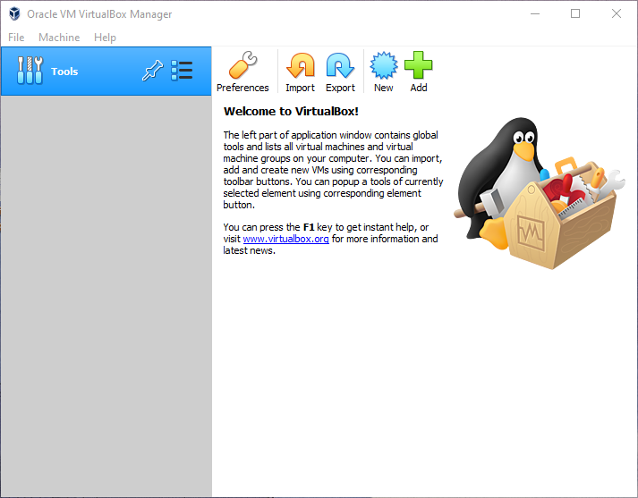

# Install VirtualBox Software on a Windows System

Step 1. Double click the installation file - `VirtualBox-version-number-Win.exe`  (Note: In the file name, `.exe` is called file extension. It tells user what type of file it is. The extension`exe` means it is an executable file. You maybe thinking, all files I have been clicking "executes" a program? But that is not true. When you click a file, the operating system automatically launches the default program, usually an executable file, that can open the type of file. )You will be greeted by the following screen. Click next. 

Step 2. The configuration process started. Please leave everything as/is in the following screen. 

Step 3. You may freely choose whether to select the second and the third options, but better leave the first and the last options selected. 

Step 4. Click Yes. There is nothing you and I can do here. Then, click through the rest of the processes, until you encounter a prompt. 

Step 5. Click `Install` to proceed. This will be the only prompt you will be encountering during the installation. 

Step 6. After the installation, if you open the program by clicking the icon, the following screen will show up. If you see this, congratulations!

