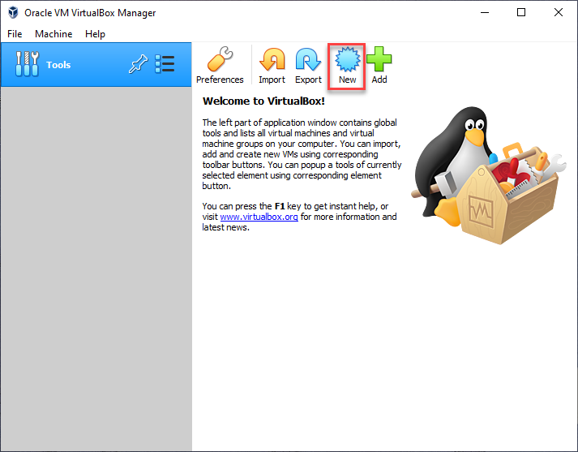
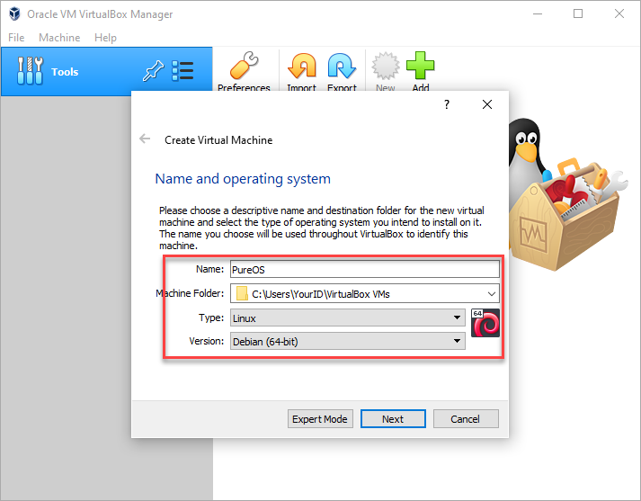
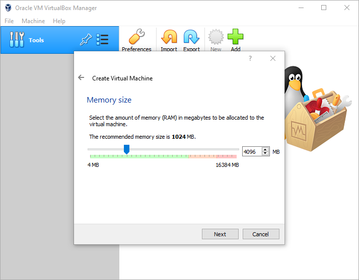
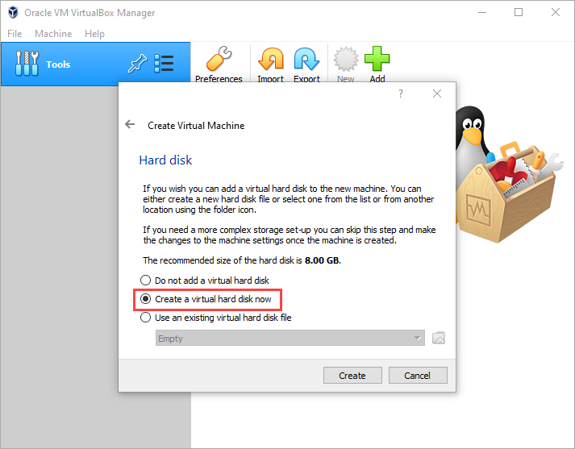
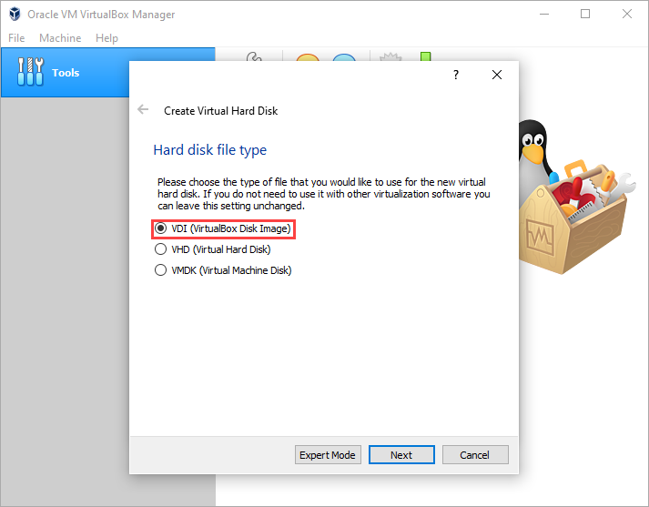
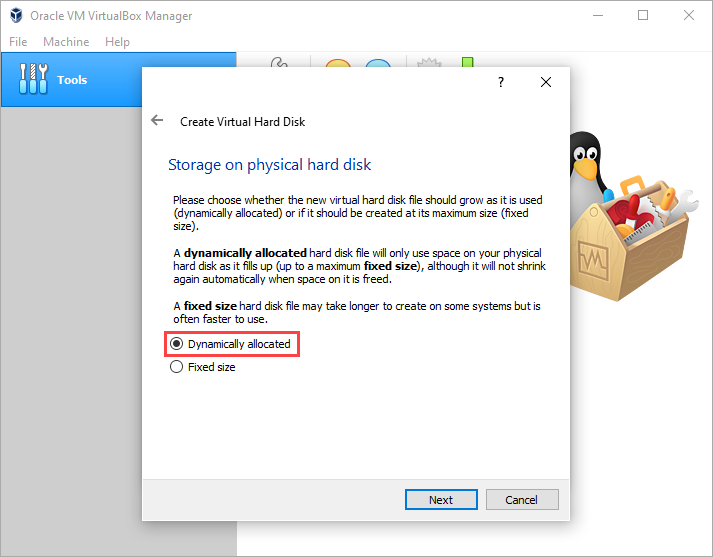
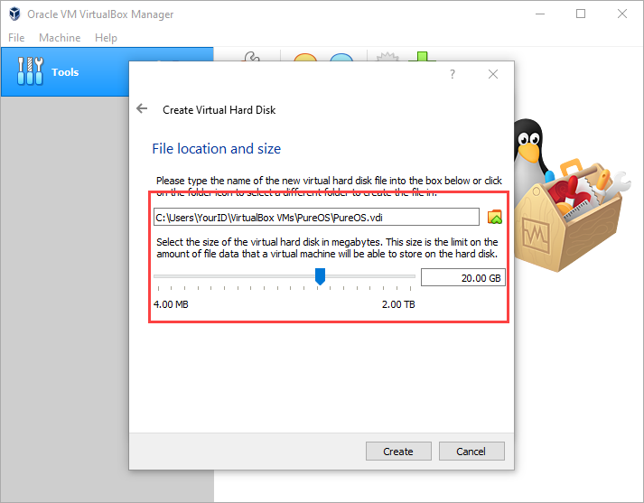
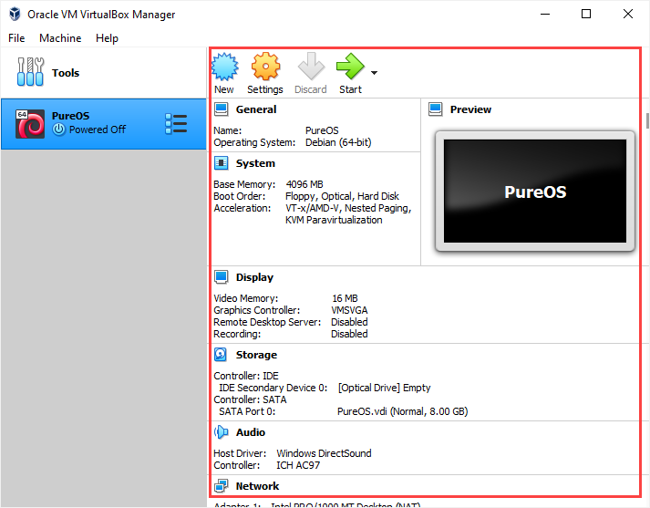
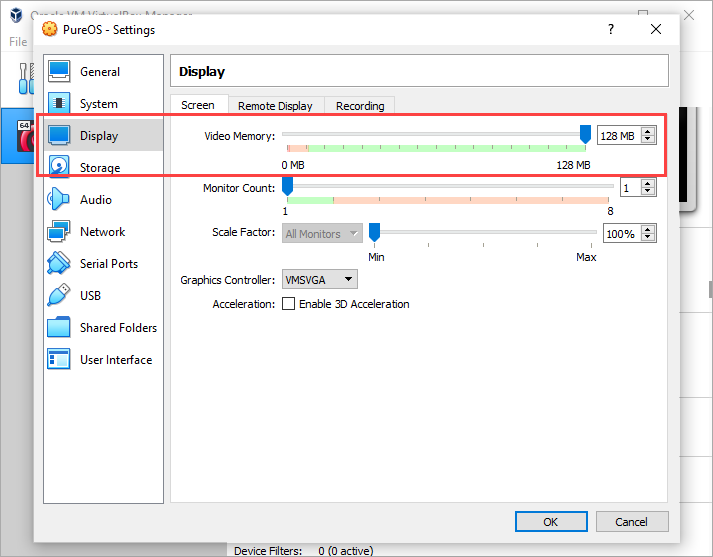

# Create the First Virtual Machine 

Step 1. Click `New`  to create your first ever virtual machine using VirtualBox software. 

Step 2. Your virtual machine will be saved as a file. Give it a proper name, specify the storage location. For the `Type` option, select `Linux`, and for the version, select `Debian (64-bit)` . Please double check the last two options. 

Step 3. You can specify the memory size of the virtual machine. You can choose whatever amount you like. But it needs to be bigger than `1024 MB` and within the green bar. Why bigger than `1024 MB`? That is the minimum memory requirement according to the download section of the PureOS website. It is recommending `4096 MB`  here [PureOS website.](https://tracker.pureos.net/w/pureos/hardware_requirements/) Why stay within the green range? Because you are creating a virtual computer within your actual computer. Therefore, you should never expect that the (virtual) computer performs above and beyond your (actual) computer. If you are on a WSU-lease laptop, `4096 MB` can be a good choice. 

Step 4. This virtual computer also needs a virtual hard disk storage space. Select the second option. 

Step 5. Let's stay with the suggestion for this one. Your virtual hard disk file will have an extension with `.vdi` 

Step 6. This is about the resulting file size of the `.vdi` file. The first option will be dynamically adjust the size of the file, while the second option will try to create a big file from the beginning. 

Step 7. I am using the following setting. The hardware requirement says the space needs to be at least `15 GB`. But since we are only going to use it briefly, if your computer is running out of space, please use as little as `8GB` . Then click `Create`. 

Step 8. You can scroll down the following screen to review the information about the (virtual) computer you have created inside of your (actual) computer. 

Step 9. Let's give the virtual machine a little more display power. Click `Setting`, in the following dialog box, go to `Display` section, increase video memory to `128MB` or anywhere within the green range. Click `OK` to confirm. 

Step 10. Let's turn on the computer by clicking the `Start` icon! It will take some time for the computer to "boot up". Please watch the following video for a brief introduction of the environment. 

https://youtu.be/L_8bhRZjrUs
