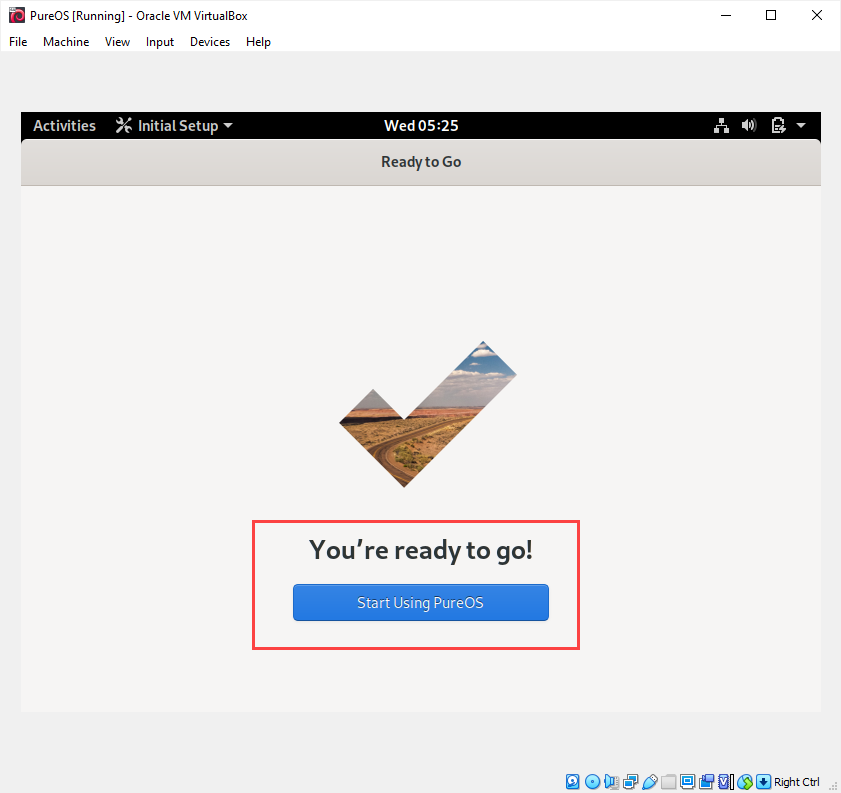

# Install PureOS on the Virtual Machine

Step 1. Load the downloaded `.ISO` image file in the `Settings` > `Storage` > `Optical Driver` > `Choose a disk file`. Then, click `OK` to confirm. 

Step 2. Start the machine. Note that the image file is currently loaded under `Controller: IDE`. 

Step 3. Select `Test or Install PureOS` option. 

Step 4. Note that the current OS supports `mouse pointer integration`. That means you no longer need to press `Ctrl` key to release the pointer. That is good!

Step 5. Choose language. 

Step 6. Choose Keyboard layout. 

Step 7. Choose Privacy setting. 

Step 8. Skip this part. 

Step 9. A small victory!

Step 10. Try to change the screen resolution to `1440 x 900`. This will allow you to see more contents in the same screen. 

Step 11. So far the PureOS is running temporary on the virtual machine. Let's make the PureOS stay in the virtual machine permanently by install it. This step will take about 10 minutes or longer. You may also experience some hiccups. But eventually you will be fine. 

Step 12. After reboot into the PureOS, you will be promopted by a password. Then, you will go through a similar process from step 5 to step 10. After all the steps, you can try to choose to use `FireFox` browser from `Activities` to open `https://www.winona.edu` . That is the big victory!

