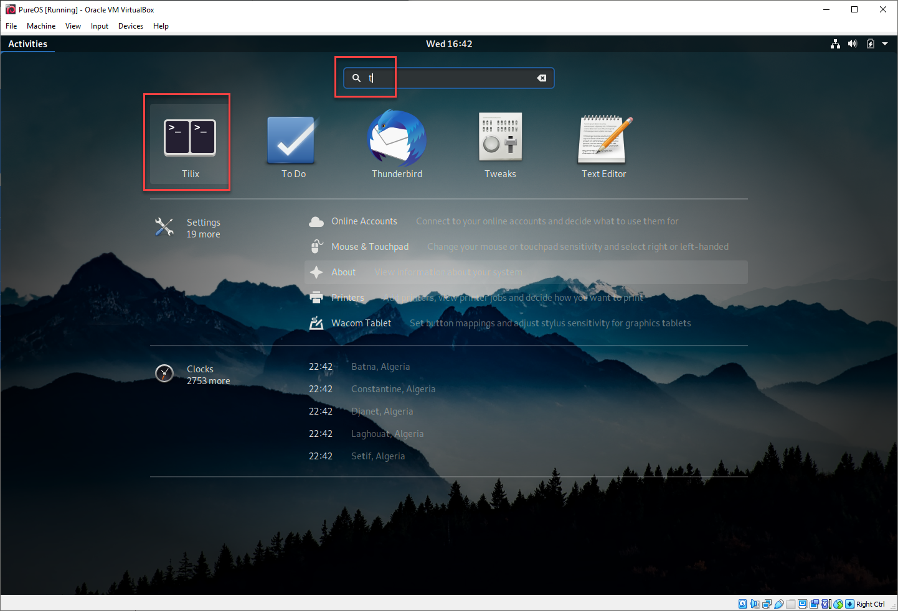
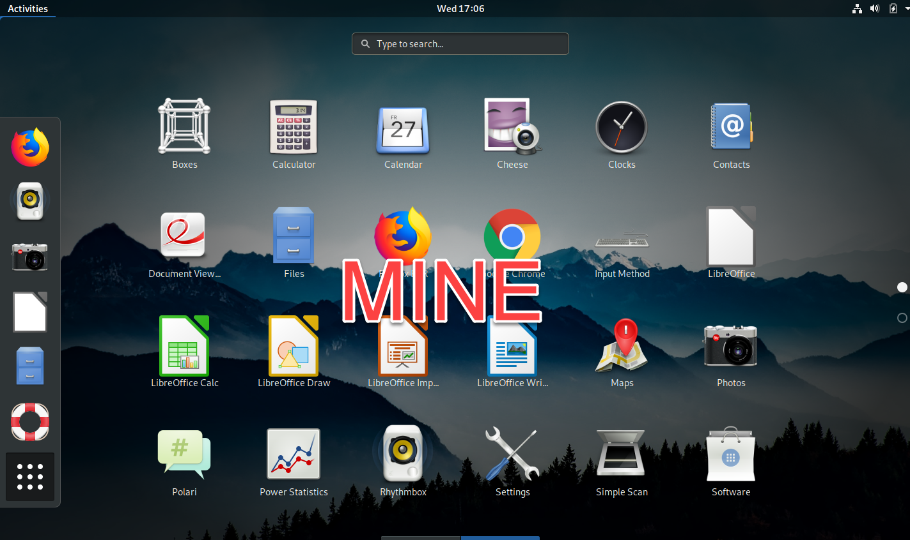

# Assignments for Virtual Machine Part

## 1. Get the hash value for the following file. 

Note that the instruction is available through [here](https://zwentt.github.io/wsu-mis-362/1.1%20Download%20VirtualBox%20and%20Pure%20OS) in section 4. 

The file that you will be generating the hash value from is the PowerPoint file that I used in "[Special Topic: Future of Work](https://winona.learn.minnstate.edu/d2l/le/content/5426063/viewContent/51099965/View)". Note that you need to download the file (file extension will be `.pptx`) and save it to the desktop for the convenience of running command from either Windows or macOS. (Hint: As you generated the hash values for virtualbox and pureOS installation files, you are generating the hash value for the .pptx file.)

**Submission Requirement:** 

> See attached Word file. You only need to report the SHA256 value. 

## 2. Within the Pure OS, please get the hash value for the following file.

Note: If you have successfully installed Pure OS in the virtual machine (not just booted with the Pure OS), it is better for you to "eject" the `iso` file from the virtual machine settings.  (Note: you inserted the `iso` virtual disk as the first step of installing the Pure OS.) Otherwise, the virtual machine may attempt to let you install Pure OS again since it may boot into the `iso` disk, not the virtual disk. 

**Step 1.** Go into the Pure OS (This means, you need to open the VirtualBox software, turn on the virtual machine, log in with your credentials, all that.)

**Step 2.** [Download the file](https://www.winona.edu/Images/WSU-Campus-and-Mississippi-Aerial.jpg) and save it to the Desktop. It is best you complete this step within the Pure OS. The URL of the file is `https://www.winona.edu/Images/WSU-Campus-and-Mississippi-Aerial.jpg` Please make sure you type the whole address, do not exclude anywhere before `winona.edu` If you did, the page may not open correctly. 

**Step 3.** Search the console tool (like the `terminal` in macOS and `cmd` in Windows). In Pure OS, the tool is `Tilix` . Click `Activities` button, then, type `t` in the search box. It will show all contents that begins with the letter `t`. `Tilix` is the first one. 

Step 4. Repeat the steps you have taken in the section `1.1 Download VirtualBox and Pure OS`, step 3 and 4. Do something similar except this time the command you can  use is

- `ls` - show what is in the directory (similar to `dir` in Windows and `ls` in macOS)
- `cd targetDirectory` - `cd` means "change directory", the `targetDirectory` is where the file is currently stored. Remember that I recommended the file be stored in `Desktop` . 
- `sha256sum targetFile` is the syntax you need to create the SHA256 value. 

**Submission Requirement:** 

> Report the SHA256 value in the Word file. Also,  screen capture the Tilix screen that shows your steps. 

## 3. Using `Tilix` to Install Chrome Browser in Pure OS

Two lines of command are needed to install Chrome Browser in Pure OS. 

Step 1. Download the package to the current folder. In `Tilix` type, 

`wget https://dl.google.com/linux/direct/google-chrome-stable_current_amd64.deb` 

Step 2. Install the package in the Pure OS. You maybe prompted with the password when executing the following command. 

`sudo apt install ./google-chrome-stable_current_amd64.deb` 

Note: 

- `wget` is the command to retrieve contents from web. 
- `sudo` mean "super user do"
- `apt` mean "advanced packaging tool"

**Submission Requirements:** 

> Open the `Activities` button, you will see Chrome is somewhere in the pool of apps. Screen capture it and attach the image in the Word document. In macOS, screen capturing key is `shift`+`command`+`3` (see [more here](https://support.apple.com/en-us/HT201361)). In Windows, screen capturing is `Win` + `Shift`+`S` . For example, 
>
> 

**The End**
