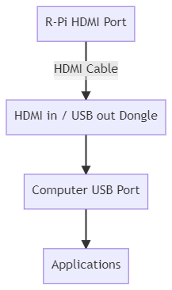

# 2.0 Get Raspberry Pi 3 B+ Ready 

## 1. Put the R-Pi into the Enclosure 

**First,** please visually scan the naked R-Pi board so that the you can remember some of the "landmarks" on a R-Pi board. 

**Second,** please carefully secure your R-Pi board within the enclosure. 

**The following video will help you navigate through two steps above ** 

**Third,** before proceed, please check yourself to see if you can answer the following questions. 

- [ ] I know how to secure my R-Pi using an enclosure. 
- [ ] I know how to turn-on my R-Pi. 
- [ ] I know how to plug my keyboard and mouse to my R-Pi. 
- [ ] I know where to insert micro SD card in my R-Pi. 
- [ ] I know how to turn-off my R-Pi. 
- [ ] I know where the HDMI port is in my R-Pi. (Note: HDMI - High-Definition Multimedia Interface)
- [ ] True or False: the HDMI port in my R-Pi is used to accept an inbound HDMI connection. 

## 2. Understand What HDMI-USB Video Signal Converter Dongle Does

**Note: there is nothing you can do immediately after reading this. That is because your R-Pi still does not have an Operating System in it, therefore it cannot display anything. But please make sure you understand this part so that you know what to do after R-Pi OS is installed. ** 

Remember that we have purchased the following USB dongle. (Note: USB - *Universal Serial Bus*)

What does it do? Simply put, it can turn your laptop screen into a monitor for R-Pi. 

In general, an R-Pi needs a display device. There are two ways an R-Pi can output the video signals. One way is through its internal 16 pin connector and the other way is through the HDMI interface. Plainly speaking, you will need to connect the R-Pi to a HDMI supported TV or a computer monitor. We don't have external monitors in our classroom. Some of our students don't even have an external monitor or a TV in their dorm rooms. 

The dongle can help convert any HDMI signal into a digital data stream that can be read and captured by a computer. Specifically, an application on your computer will be able to read data stream through the USB interface. For example, in Windows computer, the Camera app will be able to display the inbound display signal (through USB). For macOS, users can use [webcamtests.com](https://webcamtests.com/) to display the inbound signal. The technical flow looks like the diagram below. 

Before proceed, please check yourself to see if you can answer the following questions. 

- [ ] True/False: At this point, my Raspberry Pi will be functioning if I plug a monitor to it. 
- [ ] True/False: The USB dongle takes-in video signals through the USB interface, then export it to the HDMI displays. 

- [ ] 

