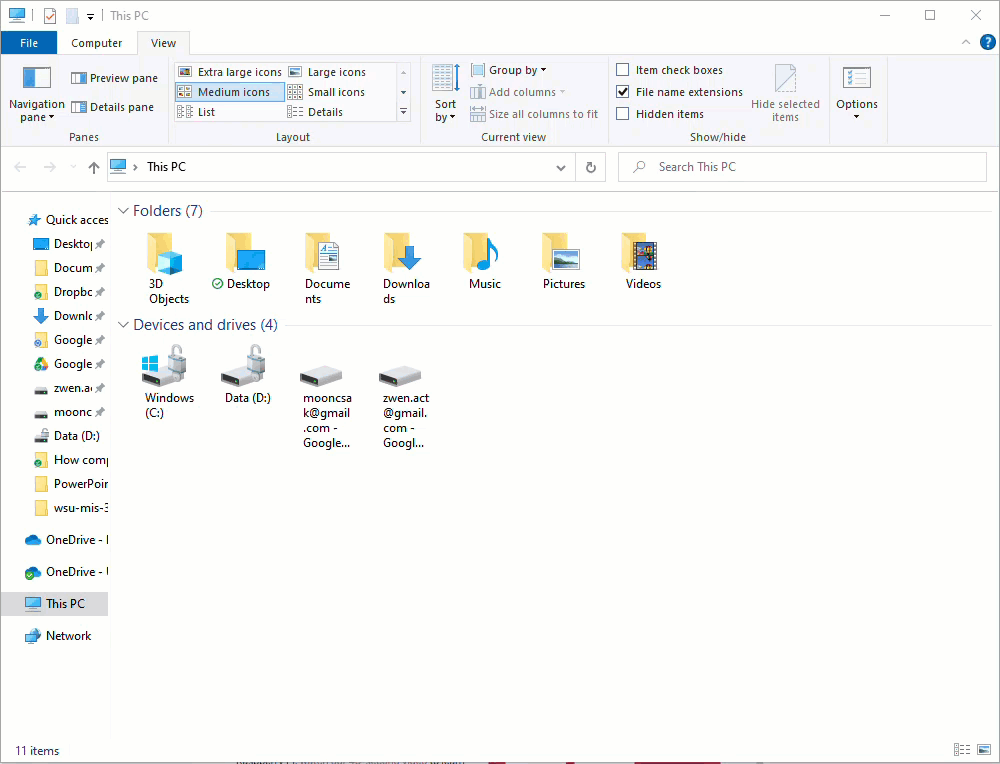
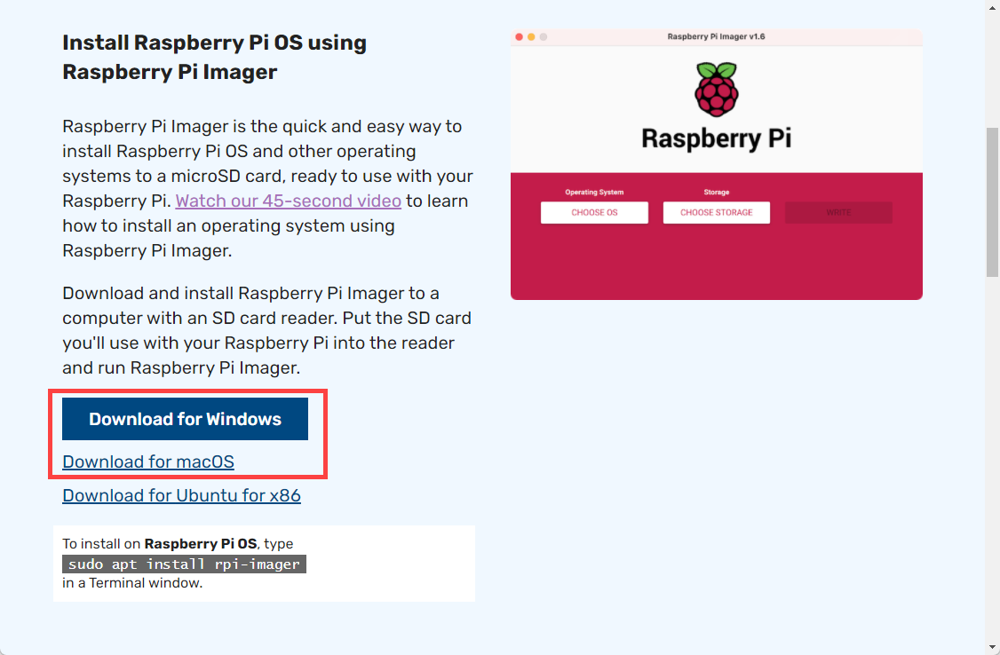
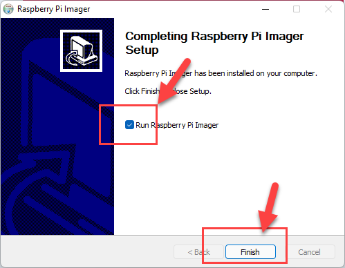
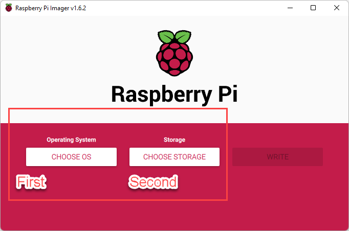
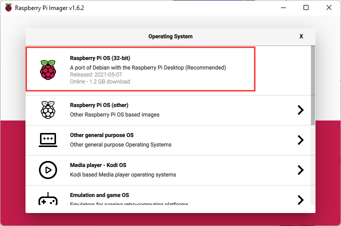
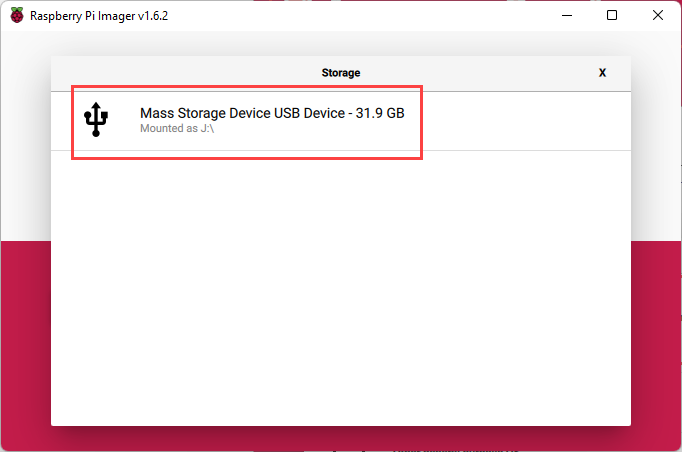
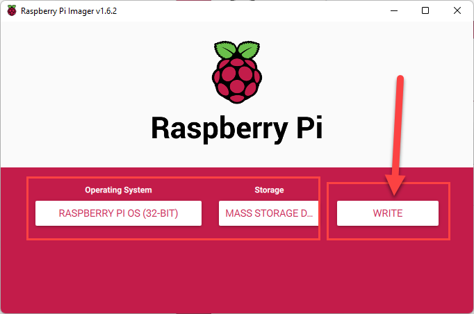
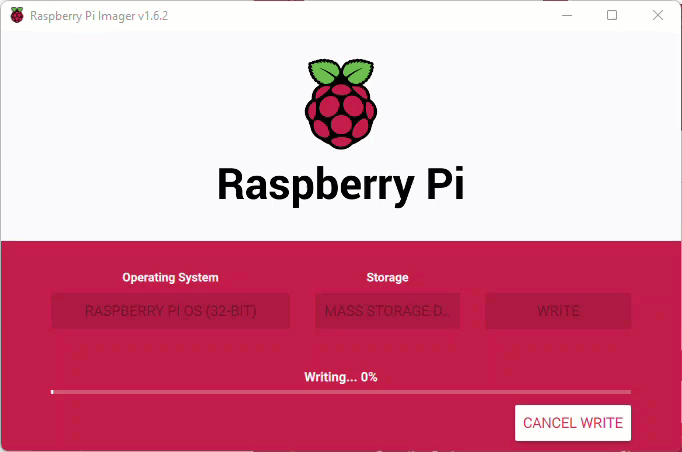
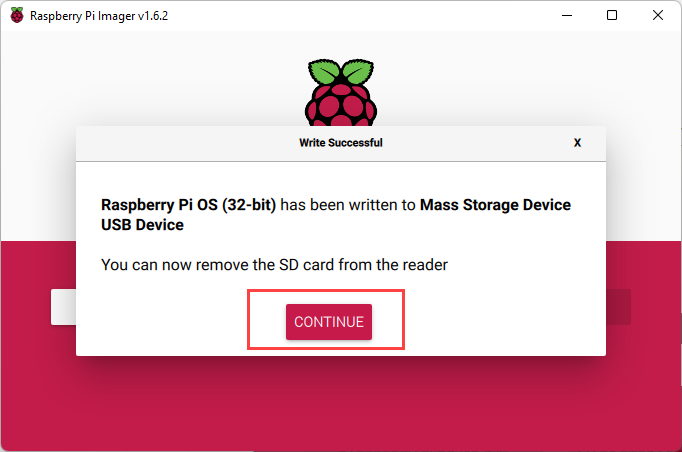

# 2.1 Install Raspberry Pi OS

This part will help you install a Raspberry Pi OS to your R-Pi. Specifically, we will "burn" a operating system image into the Micro SD card, then "load" the Micro SD card into the R-Pi. Then, the R-Pi will recognize the operating system and will "boot" itself with a fully functioning OS. Before your R-Pi is loaded with an operating system, it is basically a box that is good for nothing!

**Step 1.** Insert Micro SD card into the Micro SD card reader. The shape of the reader varies and mine looks like the one below. Then insert the card reader into your computer through the USB interface. (Note that MacBooks do not have regular USB port. But they do have USB-C port. Therefore, you need to use USB-A to USB-C converter. So, if you are using a Macbook, that means, you need to 1) insert Micro SD card into the card reader, 2) insert the card reader into the USB-A to USB-C adapter, then, 3) insert the USB-C end of the adapter into the Macbook.) 

If you are a MacBook user, the USB-A to USB-C adapter looks like this. (Sorry for the image. :) 

**Step 2.** When the Micro SD card is inserted into your computer correctly, you will very likely notice the move. For the Windows computer, in my case, it is listed as `Sandisk (E)` Disk. Yours may look different. 

**Step 3.** Download Raspberry Pi Imager (about 20 MB) from https://www.raspberrypi.org/software/ 

**Step 4.** It is a simple installation. Please run the imager software after the installation is finished. It will help you "burn" an OS image into the micro SD card. (Note: you don't need to mess around with an ISO image file, it is all happening behind the scene.)

**Step 5.** Next two steps are crucial. First, you need to choose the operating system correctly. Second, you will have chance to specify to which storage device the Raspberry Pi operating system is going to be installed. 

**Step 5-1.** In the first choose option, please choose `Raspberry Pi OS (32-bit)`.  (Note: there are some other interesting options available. But you can explore at the end of the semester.)

**Step 5-2.** In the second choose option, please select your Micro SD device. If nothing shows up here, it means your Micro SD card is not plugged to your computer correctly. 

**Step 5-3.** Then, click `Write` to proceed. 

**Step 5-4.** Wait until it finishes. 

**Step 6.** Your done! You should be able to see a new disk with a name `boot` in your computer. 

