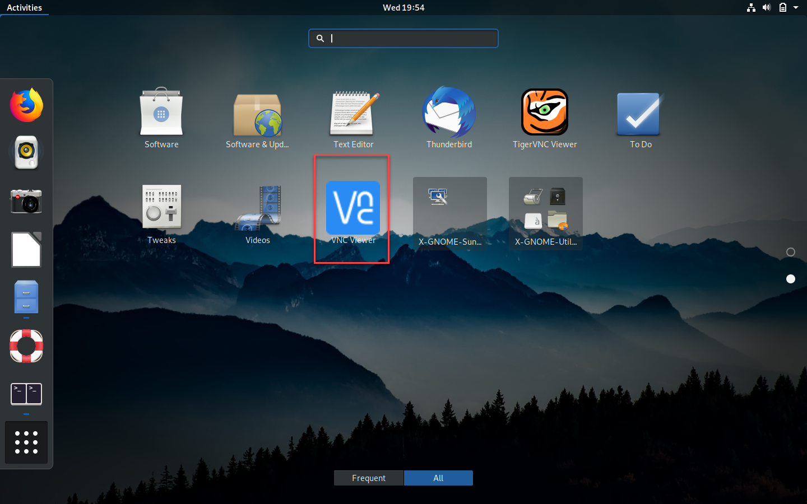

# 2.2 Connect to an External Display 

It is time to plug an external display device to see whether your Raspberry Pi boots without any problem. **Please do not plug your keyboard and mouse at this time. **

## Connect HDMI-supported Computer Monitor or LCD TV

If you have a monitor or TV that can be connected using HDMI cable, this step will be very easy. Plug the HDMI to your monitor (or TV), then plug the power cable (i.e., Micro USB cable) to your Raspberry Pi. Usually, your Pi starts with the following screen.


## Connect to a Laptop through HDMI-to-USB-Signal Converter Dongle

*For the technical information about this approach, please refer to the [section 2.0 and part 2](https://zwentt.github.io/wsu-mis-362/2.0%20Get%20Raspberry%20Pi%203%20B%2B%20Ready#2-understand-what-hdmi-usb-video-signal-converter-dongle-does) for this approach.* 

### Windows Users

Plug the dongle into the computer, then open the camera app (search from Windows app). Then, change the "camera" into your Raspberry Pi screen. 


### macOS Users

Plug the dongle into your MacBook. Then open the following website: [webcamtests.com](https://webcamtests.com/) Alternatively, you can use the "Photo Booth" app. For details, please watch the video below. 

[](https://www.youtube.com/watch?v=uglkgmxcONQ "Switch Cameras when the Dongle is Plugged")


## Getting Ready to Connect through VNC Viewer

The VNC viewer allows you to remotely connect to a Raspberry Pi. Once become familiar, this will one of the primary ways of gaining access to your Raspberry Pi. As the first step, please install VNC Viewers on the Pure OS and on your Windows (or MacBook.)

Please run the following two lines of command through the Linux terminal (Tilix) to install the VNC viewer. Note that this step is very similar to the previous assignment - Installation of Chrome Browser

```shell
wget https://www.realvnc.com/download/file/viewer.files/VNC-Viewer-6.21.406-Linux-x64.deb
```

then, 

```shell
sudo apt install ./VNC-Viewer-6.21.406-Linux-x64.deb
```



Lastly, please register an account from VNC through the following link. Once registered, please do not forget the user name and the password. This concludes this section of the activities.

> https://manage.realvnc.com/en/auth
