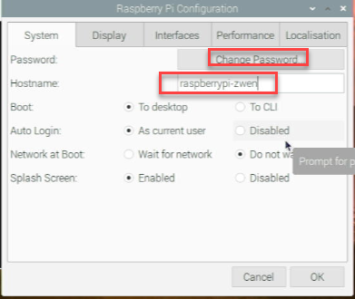

# 2.3 Raspberry Pi Initial Configuration 

## 1. Raspberry Pi Configuration 

Step 1. Please click the Raspberry icon on top-left in the screen.  Open "Preferences >> Raspberry Pi Configuration >> Configure Raspberry Pi system". 

Step 2-1. Change all circled items. For the hostname, please use `raspberrypi-first initial last` . Please remember the password. If forgotten, there is no way to retrieve it other than re-do the image copying. User name is `pi` , do not change it. 

Step 2-2. In the `Interfaces` section, please enable `ssh` and `vnc`. 

Step 2-3. In the "Localisation" adjust all items (i.e., Locale, Timezone, Keyboard, and Wireless LAN Country. ). Please make double sure that `Wireless LAN Country` is selected properly. Otherwise, the R-Pi will not be able to connect to the Wi-Fi network. 

(See below for setting Wireless LAN Country)

**Step 3. Connect to Wi-Fi.** You don't HAVE TO connect to Wi-Fi while you are in Somsen 312 class. Because you will be provided with an ethernet cable. But you will need to connect to Wi-Fi in anywhere else. Currently, Raspberry Pi only connects to WSU-Guest Network. 

