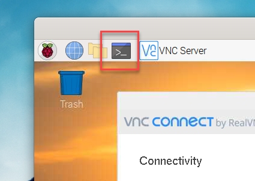
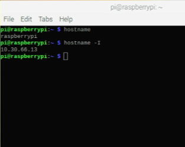

# Obtain the IP Address of Your R-Pi.

This step is crucial, therefore it is listed as a separate section. You will need to do this repeatedly in order to connect to your Raspberry Pi. Please make sure that your R-Pi is connected to the internet. 

Step 1. Open the Linux Terminal within Pi. 



Step 2. Type the following command. 

```shell
hostname -I
```

Then, it will display the IP address. Please write it NOW. 



