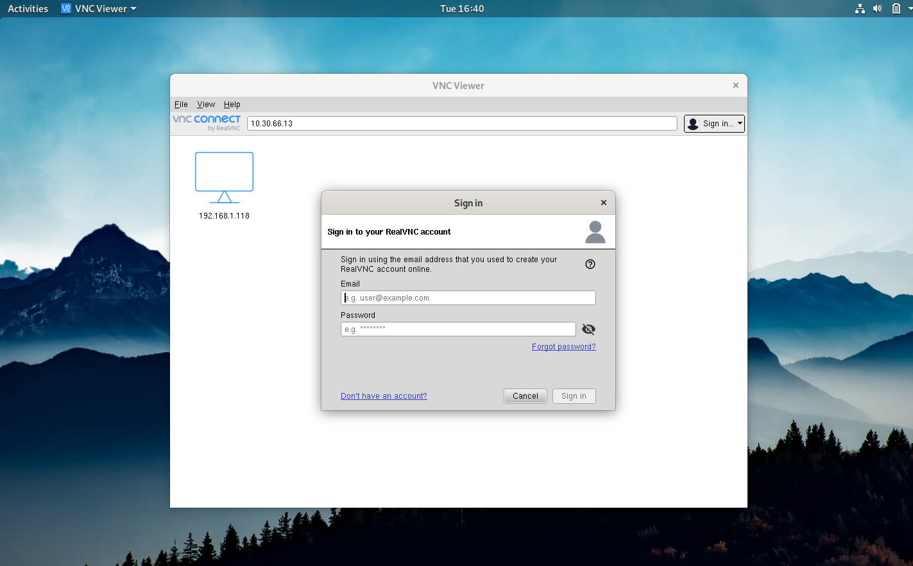
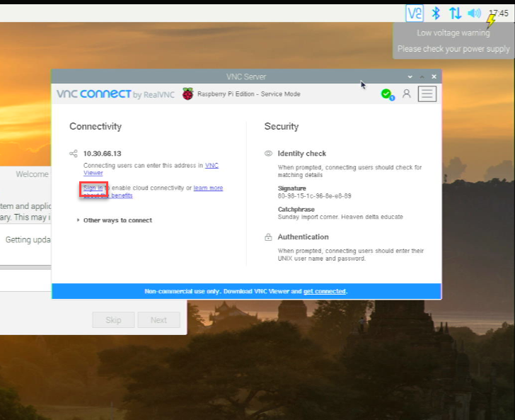
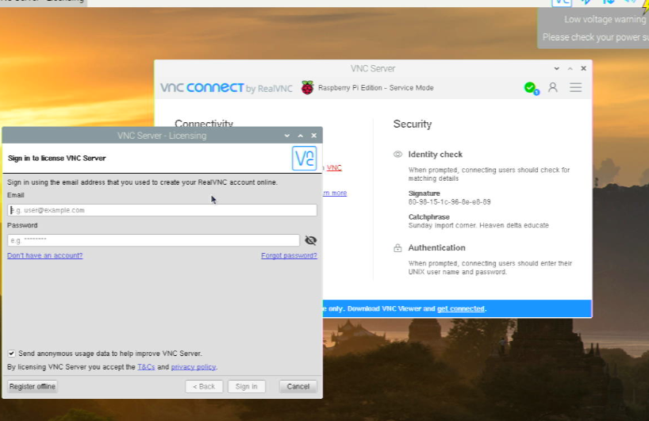
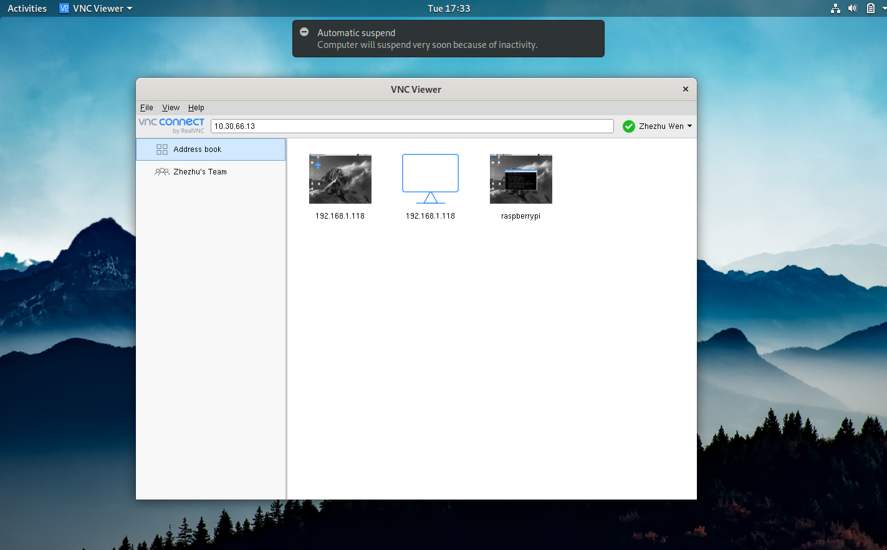
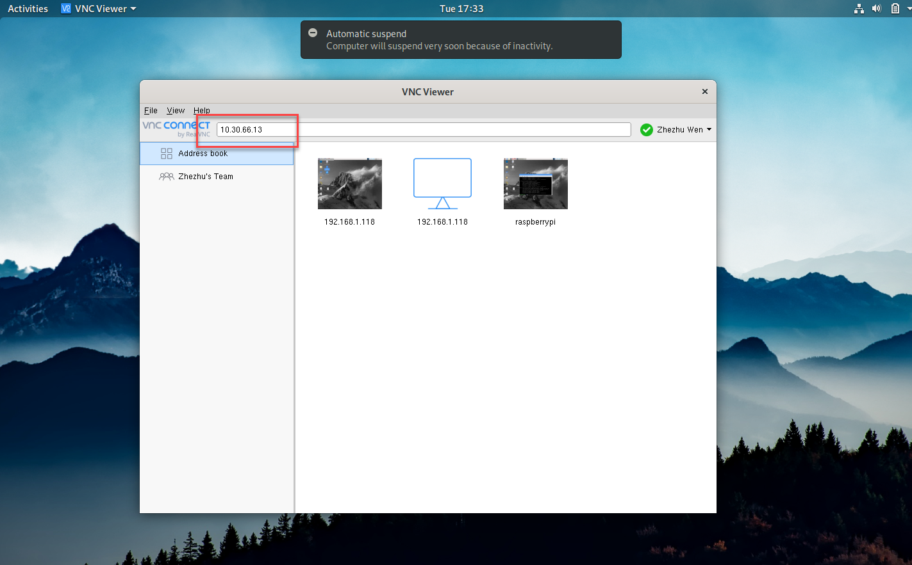
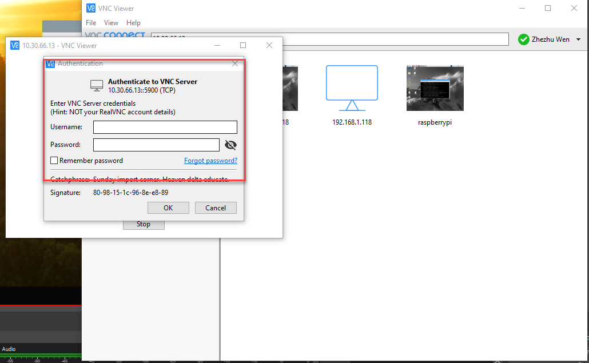

# 2.5 Configure VNC for Remote Connection

You can connect to your Raspberry Pi through VNC in two different ways: 

* Connect to R-Pi through Internet.
* Connect to R-Pi through Local Area Network. 

First option is convenient when trying to connect to R-Pi from a different network environment (e.g., connect to R-Pi at home from school). Second option is convenient when connecting from the same network. The first option can be slow, but the second option is usually lot faster. 

To proceed, you should have already completed the following activities from your HW03. 

* Created VNC account. 
* Installed VNC in your Pure OS. (Note: In case your Pure OS does not work at this point, please contact me ASAP.)

## 1. Connecting through Internet

Step 1. Please Login to VNC Viewer software from Pure OS. There are more steps involved, but is skipped. Those are usually related to the two-factor authentications (aka. trying to verify whether you are really who you are. )

Step 2. Login to VNC Server in your Pi. Again, minor steps are skipped. 

Step 3. Come back to VNC Viewer (from your Pure OS), you will see your Pi there. 

Step 4. Double click to connect your Pi. 

**Note that this method will work regardless where you are connecting from.** 

## 2. Connecting through Local Area Network 

Before proceed, you need to know the IP address of your Pi (which you have obtained in the previous section 2.4)

Step 1. Open VNC Viewer. Type the IP address of your Pi in the address bar. 

Step 2. You will be required to enter the login credentials of  your Pi. (Your user name is usually Pi. You know your password. )

