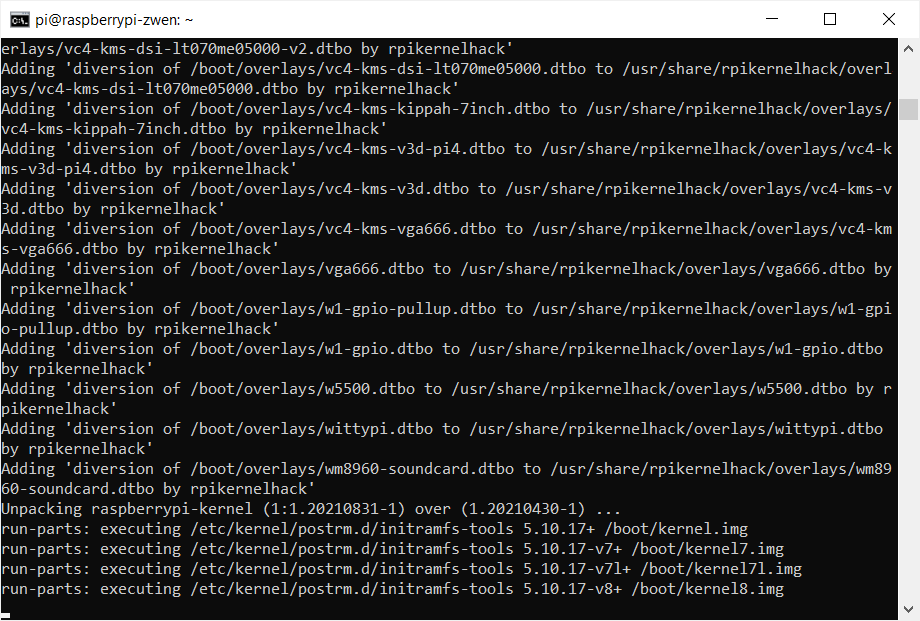
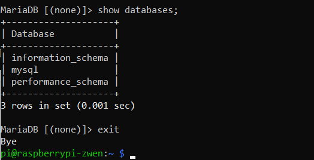

# 3.0 Setup MariaDB

In this module, we are going to install a popular DBMS called MariaDB on our Raspberry Pi. It is a variant of MySQL, a popular open-source relational database management system. In 2010, when Oracle acquired MySQL's parent company Sun, the creator of MySQL, Widenius "forked (Note: spin-off from one open-source product)" the open-source MySQL project to create MariaDB. 

There are two steps in this initial module:

* Updating Raspberry Pi OS (about 15 min., depending on how up to date your OS is.)
* Install MariaDB (about 2 min.)

### 1. Updating Raspberry Pi OS

Updating Raspberry Pi OS with the latest packages and system components can minimize unexpected errors that maybe arising from installing and using MariaDB. Usually, Linux systems maintain a several repositories of software packages. The mechanism functions very similar to the appstore concept. Only software or packages that are not available from the central repositories require additional download processes as you have experienced with Chrome and VNC viewer installation. Cmatrix is a good example of a typical package installation experience in Linux.

**Step 1.** Identify and retrieve information on all upgradable components and packages

```shell
sudo apt update 
```

**Step 2.** Actually upgrade all the packages, components, and their dependencies. 

``` shell
sudo apt dist-upgrade
```

**If any warning pops up, please read it to see what is it asking for.** In general, you can agree with whatever it is requesting. 

This process will take about 10 to 15 minutes depending on how recent your Raspberry Pi OS is.

Something like this will show up. 




### 2. Install MariaDB

**Step 1.** Install MariaDB on your Raspberry Pi by typing

```shell
sudo apt install mariadb-server 
```

This will be a frustration-free installation process that will be done within a couple of minutes. 

**Step 2.** Once the installation is done, please try the following command to gain access to the MariaDB. 

```shell
sudo mysql 
```

**Step 3.** Once you are in, please confirm the following things. 

* Command prompt has changed to `MariaDB [(none)]` (the green rectangle)
* Currently selected database is `none` (the red rectangle)


**Step 4.** Let's see what databases are currently in the MariaDB system by typing: 

*Note: whenever you see a capital-letter command, that means it is a SQL command and you should use it within MariaDB, not a Linux terminal.*

```sql
SHOW DATABASES;
```

You will see that it will list the following three databases. 

Without lingering in there too long, let's immediately exit the system by typing, `exit` , then hit the keyboard `Enter` key. 




This concludes the this module. 

**Before you go, please see if you can answer the following questions:** 

- [ ] How to let my Raspberry Pi OS remain current? 
- [ ] How to install a package from the repository using `sudo apt install` command
- [ ] How to gain initial access to MariaDB
- [ ] How to see the list of databases currently in MariaDB
- [ ] How to exit from MariaDB

