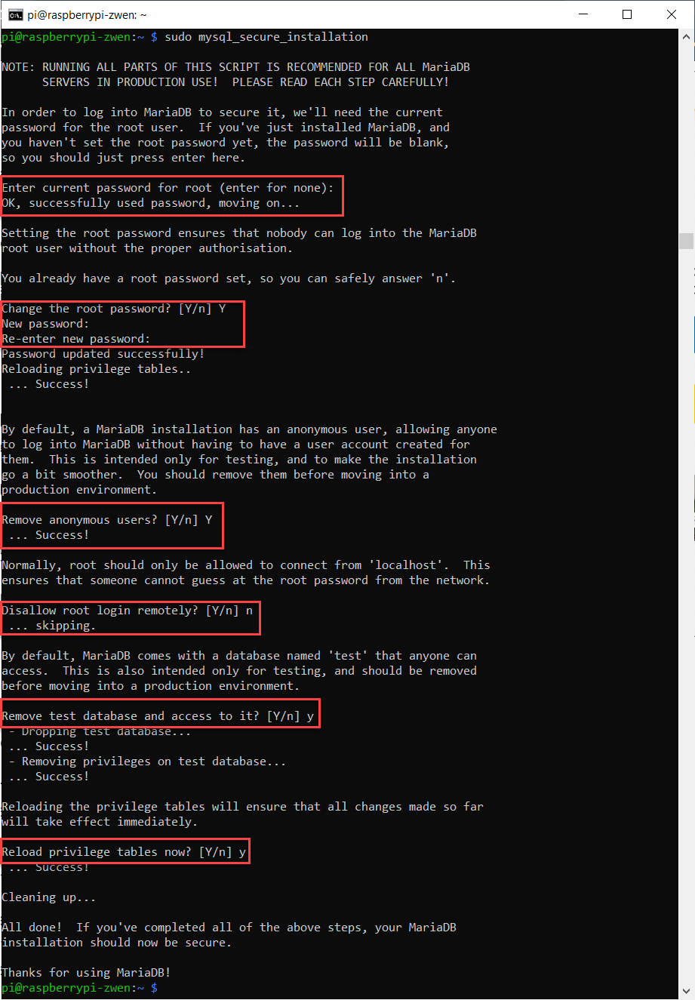

# 3.0 Setup MySQL 

### 1. Preparation 

identifies all the upgradable components and packages

```shell
sudo apt update 
```

upgrade all the packages and the dependent components 

``` shell
sudo apt dist-upgrade
```

If any warning pops up, please read it to see what is it asking for. In general, you can agree with whatever it is requesting. 

Something like this will show up. 

This will take about 10 to 15 minutes depending on when is your last update. 


```shell
sudo apt install mariadb-server 
```


```shell
sudo mysql 
```


```sql
SHOW DATABASES;
```


```shell
sudo mysql_secure_installation
```

1. Enter current password for root: 
2. Change the root password [Y/n]:
3. Remove anonymous users? [Y/n]:
4. Disallow root login remotely? [Y/n]: n
5. Remove test database and access to it? [Y/n]: y
6. Reload privilege tables now? [Y/n]: y




```sql
CREATE USER 'exampleUserName'@'localhost' IDENTIFIED BY 'password';
```


```sql
GRANT ALL PRIVILEGES ON *.* TO 'exampleUserName'@'localhost';
```


To allow privileges only on y table under x database, 

```sql
GRANT ALL PRIVILEGES ON x.y TO 'exampleUserName'@'localhost';
```


```sql
FLUSH PRIVILEGES; 
```

