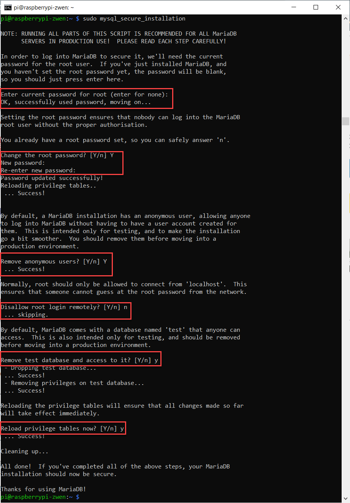
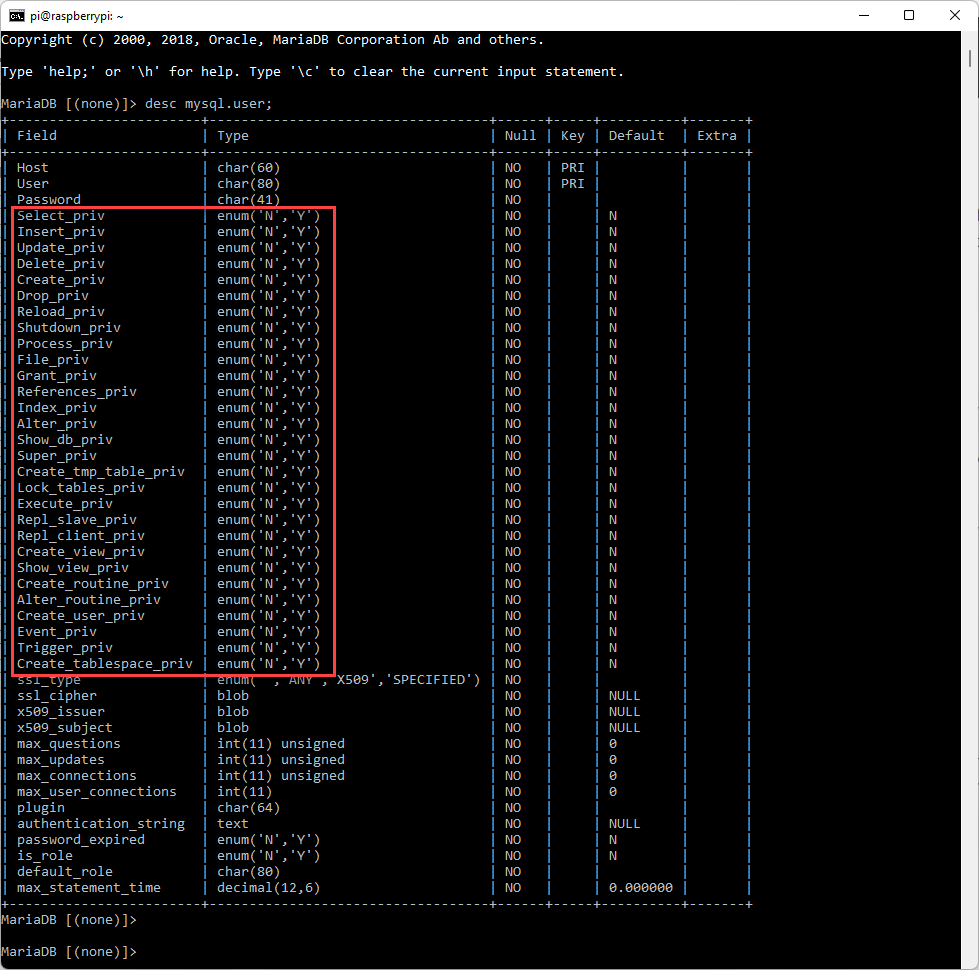
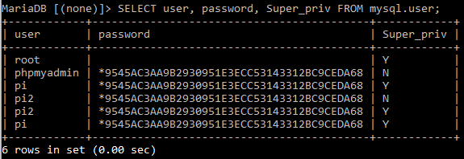
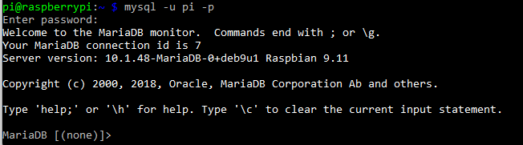

# 3.1 Manage User Access

It appears that gaining access to MariaDB is quite simple. However, your MariaDB is not ready for a serious challenge. We simply did `sudo mysql`, and gained access to MariaDB. Clearly, not all users are super-users, who owns everything in the system. Basically, `sudo` means super-user do!

Remember that a DBMS should allow a concurrent access to the database. That means, MariaDB should allow different users to gain access simultaneously. Presumably, each user should be granted for different permissions such as creating, deleting, altering, reading, writing, etc. In this module, we will maintain several configurations to allow MariaDB to have a somewhat stricter user control. 

There are three items in this module: 

* Initial effort to secure MariaDB
* Create another user
* Review what a user can do
* Login to MariaDB with the new credentials

### 1. Initial Effort to Secure MariaDB

Currently, there is only one super-user in MariaDB and his/her name is `root`. The initial configuration did not generate any password for `root` user, therefore, we should create a password for this super-user immediately. We will do this in the following step. 

Please type the following command. Then, it will prompt you to answer a series of simple questions. 

```shell
sudo mysql_secure_installation
```

Please follow the instructions below carefully. 

```
Enter current password for root: hit the keyboard enter key (because root does not have a password yet.)
Change the root password [Y/n]: Y, then set a password that you can remember.
Remove anonymous users? [Y/n]: Y
Disallow root login remotely? [Y/n]: Y
Remove test database and access to it? [Y/n]: Y
Reload privilege tables now? [Y/n]: Y
```





### 2. Create Another User

**To complete this step, you need to gain access to your MariaDB by** 

```shell
mysql -u root -p
```

Remember that you have created a password in the previous section for the `root` user. Please use that. If you are having trouble accessing MariaDB this way, please try `sudo mysql` , but it is not recommended. 


Step 1. Use the command below to create another user. In place of `exampleUserName`, please use a name of your preference. I use `pi` . In place of `password`, please enter a password that you can remember from this point. If an error message pops in this step, most likely you made a typo. 

**PLEASE DO NOT FORGET to ADD a SEMI-COLON at THE END OF EACH COMMAND IN MariaDB.** 

```sql
CREATE USER 'exampleUserName'@'localhost' IDENTIFIED BY 'password';
```

Step 2. To keep things simple, let's grant all privileges to this newly created user. Remember, in place of `exampleUserName`, you should use the username you created in the step above. (Note: `localhost` stays as is)

```sql
GRANT ALL PRIVILEGES ON *.* TO 'exampleUserName'@'localhost';
```

In case you are wondering what `*.*` means, it means grant all privileges to all databases and all the tables in this system. The wildcard symbol `*` usually means "everything". For your reference, to allow privileges only on y table under x database, you can do the following. (This is just an example. It won't return anything, but please remember the syntax here `x.y` )

```sql
GRANT ALL PRIVILEGES ON x.y TO 'exampleUserName'@'localhost';
```

Step 3. Use the following command to effectuate the change. 

```mariadb
FLUSH PRIVILEGES; 
```


### 3. Review What a User Can Do

Let's see what kind of permissions we can specify for a user. Remember we granted all privileges to this newly created user in the step above, but in general we want to be careful in terms of what permissions to give away to a new user. 

```mariadb
DESC mysql.user;
```



Let's see who else is in the system by using the command below: 

```mariadb
SELECT user, password, super_priv FROM mysql.user;
```



In my system, I have six users. Their passwords are also presented in the form of hash value. It also shows who is a super admin user and not. 

If you followed all the instructions so far, in the table above, your newly created user should display as an super admin. 

**Lastly, type `exit` to leave MariaDB.** 

### 4. Login to MariaDB with the New User Credentials

Let' try if we can login with the new username successfully. 

```shell
mysql -u newUserName -p
```

I set my username for MariaDB is pi (yours maybe different). 

`-u` means username

`-p` means password

In other words, the command line means, login to MariaDB with this username and this password. 




If it says `Access Denied`, it is most likely your username and password combination is incorrect. 


**This concludes this module. Before move on to the next one, please review the following questions:** 

- [ ] Why a concurrent access is important for a database management system? 
- [ ] What is the difference between `sudo mysql` and `mysql -u superAdmin -p` way of accessing to MariaDB? 
- [ ] Do you think you can create another user with a different username using the steps above (section 2)?

