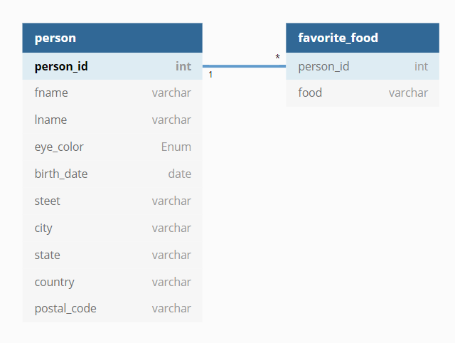
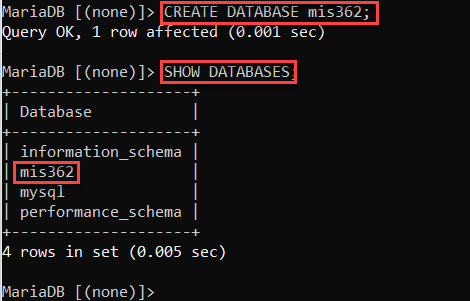
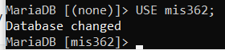
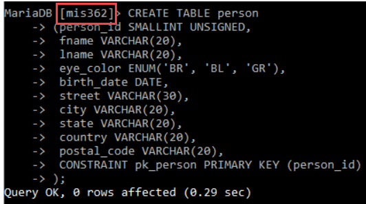

# 3.2 SQL Fundamentals: Creating Database and Tables

We now have a DBMS - MariaDB. Also have a way to gain access to the DBMS. Now, let's experiment with SQL language by 

* Creating a new database 
* Creating the tables
* Inserting the records

Following is the structure of database we seek to create in this module. 

`mis362` Database



The first table is called `person` , each record will be look like the one below. We can add more records as we go. 

| person_id | fname   | lname  | eye_color | birth_date | street       | city      | state | country | postal_code |
| --------- | ------- | ------ | --------- | ---------- | ------------ | --------- | ----- | ------- | ----------- |
| 1         | William | Turner | BR        | 1972-05-27 |              |           |       |         |             |
| 2         | Susan   | Smith  | BL        | 1975-11-02 | 23 maple st. | Arlington | VA    | USA     | 20220       |

The second table is called `favorite_food` . Of course, we can add more. Please see if you can interpret the meaning of it though. 

| person_id | food    |
| --------- | ------- |
| 1         | pizza   |
| 1         | cookies |
| 2         | nachos  |

### 1. Creating a Database

After login to MariaDB, please use the following command to create a database with a name `mis362`. 

```mysql
CREATE DATABASE mis362;
```

Once done, you can review whether the database is created successfully by using the following command: 

``` mariadb
SHOW DATABASES;
```



### 2. Creating Tables

**Step 1.** Getting into the database you have just created by: 

```sql
USE mis362;
```



Remember the hierarchy wise, tables are underneath a database. That is why we had to create a database first. Let's first create the first table `person`. You can copy and paste the following codes as/is into the MariaDB console. You can write everything in one line, but it will not be very readable. As long as you do not supply the semi-colon to the console, MariaDB will consider you are entering one long line of command in multiple lines. 

**Step 2.** Let's type (or copy and paste) the following blocks of code to create the `person` table. 

First line means to create a table with a name `person`. 

From `person_id` to `postal_code`, it basically defines the name of the attribute (or column), and the type of data that the attribute is expecting. You can also supply some other constraints for the variable. For example, `person_id` means, it should be supplied by small integers (`SMALLINT`), and non-negative (`UNSIGNED`), and it should be an automatically incrementing value (`AUTO_INCREMENT`). Other variables are very self-explanatory - `VARCHAR(20)` means it can be supplied with any characters up to 20 characters long. For the `eye_color` variable, you should provide one of the three values inside of the parenthesis. 

The last line defines that `person_id` should be used as a primary key to unique identify a record within the `person` table. 

```sql
CREATE TABLE person
(person_id SMALLINT UNSIGNED AUTO_INCREMENT,
 fname VARCHAR(20),
 lname VARCHAR(20),
 eye_color ENUM('BR', 'BL', 'GR'),
 birth_date DATE,
 street VARCHAR(30),
 city VARCHAR(20),
 state VARCHAR(20),
 country VARCHAR(20),
 postal_code VARCHAR(20),
 CONSTRAINT pk_person PRIMARY KEY (person_id)
);
```

Something like this. If it goes smooth, it will say "Query OK", etc. (Please make double sure that `mis362` is the current database selected. Otherwise, you will be creating a table under a wrong database.) 



Let's confirm what we have created by using the describe command: 

```sql
DESC person;
```


**Step 3.** Let's create the `favorite_food` table. It is now specifying more than one primary key with `person_id` being a foreign key that can be cross-referenced with a specific person from `person` table. 

```sql
CREATE TABLE favorite_food
(person_id SMALLINT UNSIGNED,
food VARCHAR(20),
CONSTRAINT pk_favorite_food PRIMARY KEY (person_id, food),
CONSTRAINT fk_fav_food_person_id FOREIGN KEY (person_id)
REFERENCES person (person_id)
);
```

Once done, please confirm by seeing: 

```sql
DESC favorite_food;
```


All tables are not successfully created!


### 3. Insert Entity Records into Each Table

**Step 1.** Let's enter first three people into the `person` table. `null` basically means you did not supply any value there. For primary key `person_id` it will automatically generate an integer that will increment in each record. For all other `null`s you are seeing, they will remain as a blank in the database. 

```sql
INSERT INTO 
person(person_id, fname, lname, eye_color, birth_date, street, city, state, country, postal_code)
VALUES
	(null, 'William', 'Turner', 'BR', '1972-05-27', null, null, null, null, null),
	(null, 'Susan', 'Smith', 'BL', '1975-11-02', '23 maple st.', 'Arlington', 'VA', 'USA', '20220'),
	(null, 'Zhezhu', 'Wen', 'BL', '1900-01-01', null, 'Byron', 'MN', 'USA', '55920');
```

It will return `Query OK` if gone successfully. Something like this. Note that the picture below show that I am entering one record. But you are doing it for three people for each person wrapped with parenthesis and separated from next person using a comma. 


To see the data in a table, the follow command can be used. List attributes you'd like to see after `SELECT`, then list the table associated with those attributes after `FROM`. If there is any attribute - table mismatch, an error will occur. 

```sql
SELECT person_id, fname, lname, birth_date 
FROM person;
```

In the following line, we are adding a condition that says list for people with their `person_id` greater than or equal to 2. 

```sql
SELECT person_id, fname, lname, birth_date 
FROM person
WHERE person_id >= 2;
```

The line below basically says only list someone with the lastname `Wen`. 

```sql
SELECT person_id, fname, lname, birth_date 
FROM person
WHERE lname = 'Wen';
```

**Step 2.** Enter values to the `favorite_food` table. The same steps here! Did you notice the pattern? The order of the values within each parenthesis must match with the attribute names provided in the second line. 

```sql
INSERT INTO 
favorite_food (person_id, food)
VALUES
	(1, 'pizza'),
	(1, 'cookies'),
	(3, 'kimchi'),
	(2, 'nachos');
```

Of course, you can use `SELECT` to review your entry. 


**Step 3.** How to change a record that is already in the table? 

You update it! 

```sql
UPDATE person
SET
	street = '1225 Tremont st.',
	city = 'Boston',
	state = 'MA',
	country = 'USA',
	postal_code = '02138'
WHERE person_id = 1;
```

This will show all the attributes from the specified table. 

```sql
SELECT * FROM person;
```


Before you move on, please see if you can answer the following questions: 

- [ ] Which command is to create a database? Answer choice: A) CREATE B) CREATE DATABASE C) INSERT DATABASE
- [ ] How to switch to a different database from the currently selected database in MariaDB
- [ ] How to see the list of databases in a MariaDB system? 
- [ ] How to see the list of tables within the currently selected database? 
- [ ] How to list all the records in a table? How to selectively list records in a table based on certain conditions? 
- [ ] Does each of the table itself provide a complete information that are more useful? Consider (and experiment) what the following SQL command will fulfill? 

```sql
SELECT p.fname, p.lname, f.food 
FROM person p JOIN favorite_food f
ON p.person_id = f.person_id; 
```

**This concludes the module.** 

