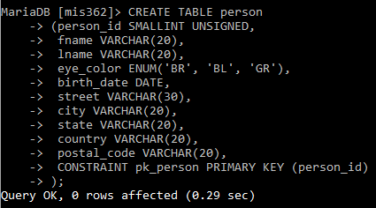
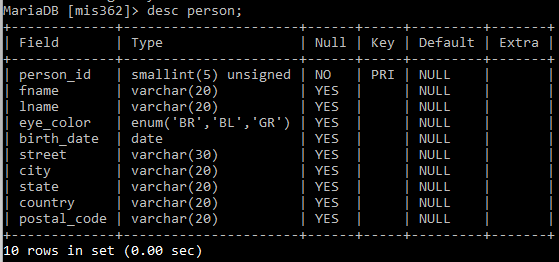
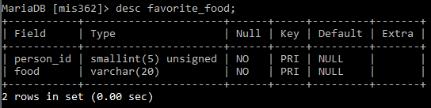

# 3.2 SQL Fundamentals: Creating Database and Tables

We now have a DBMS. Also have a way to gain access to the DBMS. Now, let's experiment with SQL language to create a new database and the tables. 

Following is the structure of database we seek to create in this module. 

| person_id | fname | lname | eye_color | birth_date | street | city | state | country | postal_code |
| --------- | ----- | ----- | --------- | ---------- | ------ | ---- | ----- | ------- | ----------- |
|           |       |       |           |            |        |      |       |         |             |


```sql
CREATE TABLE person
(person_id SMALLINT UNSIGNED AUTO_INCREMENT,
 fname VARCHAR(20),
 lname VARCHAR(20),
 eye_color ENUM('BR', 'BL', 'GR'),
 birth_date DATE,
 street VARCHAR(30),
 city VARCHAR(20),
 state VARCHAR(20),
 country VARCHAR(20),
 postal_code VARCHAR(20),
 CONSTRAINT pk_person PRIMARY KEY (person_id)
);
```



```sql
desc person
```



```sql
CREATE TABLE favorite_food
(person_id SMALLINT UNSIGNED,
food VARCHAR(20),
CONSTRAINT pk_favorite_food PRIMARY KEY (person_id, food),
CONSTRAINT fk_fav_food_person_id FOREIGN KEY (person_id)
REFERENCES person (person_id)
);
```

```sql
desc favorite_food
```




```sql
INSERT INTO 
person(person_id, fname, lname, eye_color, birth_date, street, city, state, country, postal_code)
VALUES
	(null, 'William', 'Turner', 'BR', '1972-05-27', null, null, null, null, null),
	(null, 'Susan', 'Smith', 'BL', '1975-11-02', '23 maple st.', 'Arlington', 'VA', 'USA', '20220'),
	(null, 'Zhezhu', 'Wen', 'BL', '1900-01-01', null, 'Byron', 'MN', 'USA', '55920');
```


```sql
SELECT person_id, fname, lname, birth_date 
FROM person;
```


```sql
SELECT person_id, fname, lname, birth_date 
FROM person
WHERE person_id >= 2;
```


```sql
SELECT person_id, fname, lname, birth_date 
FROM person
WHERE lname = 'Wen';
```


```sql
INSERT INTO favorite_food (person_id, food)
VALUES
	(1, 'pizza'),
	(1, 'cookies'),
	(3, 'kimchi'),
	(2, 'nachos');
```


```sql
UPDATE person
SET
	street = '1225 Tremont st.',
	city = 'Boston',
	state = 'MA',
	country = 'USA',
	postal_code = '02138'
WHERE person_id = 1;
```


```sql
SELECT * FROM person;
```


This will result a wrong message. - nonunique primary key 

```sql
INSERT INTO person (person_id, fname)
VALUES
	(1, 'John');
```

nonexistent foreign key 

```sql
INSERT INTO favorite_food (person_id, food)
VALUES
	(999, 'lasagna')
```

column value violations 

```sql
INSERT INTO person (person_id, eye_color)
VALUES
	(null, 'XK');
```


```sql
SHOW WARNINGS
```

invalid date conversions 

```sql
UPDATE person
SET birth_date = 'DEC-21-1980'
WHERE person_id = 3;
```


Join two tables 

```sql
SELECT p.fname, p.lname, f.food 
FROM person p JOIN favorite_food f
ON p.person_id = f.person_id; 
```

