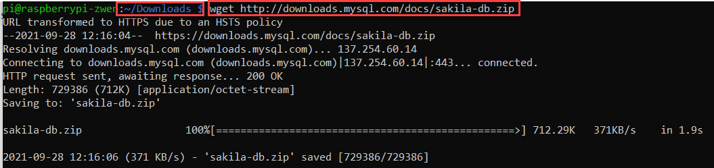
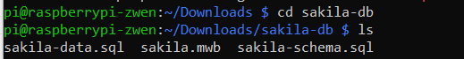
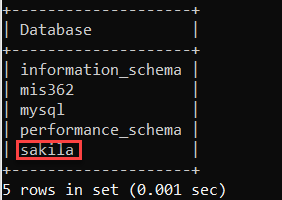

# 3.3 Example Database - Sakila 

In this exercise, we will download and import a pre-populated database file into the MariaDB so that we can use do more fun stuff! 

* Download the example database
* Import the database into the MariaDB as a new database
* Review the database and its ER-diagram


### 1. Download the Example Database

**Step 1.** please advance to the `Downloads` directory. You may find the following terminal commands helpful. 

* `cd targetDirectory` advance to a `targetDirectory`
* `ls` list all files in the directory 
* `cd ..` retreat back to the upper level directory 

**Step 2.** Please use the `wget` command to download the following file from the internet. 

> URL: http://downloads.mysql.com/docs/sakila-db.zip



:warning: The screenshot above shows what it will look once it is down successfully. Please make sure that it is download in the `Downloads` directory. 

**Step 3.** Extract the files inside of the compressed file, by 

`unzip sakila-db.zip` 

If you encountered an error message, please read it carefully and see what is the nature of the error. One possibility is that you do not have the file in the current directory. (Note: To check what is in the directory, simply do: 

`ls` 


If you are curious about what has been extracted, you can proceed to the `sakila-db` directory to see what is inside. 



Three files have been extracted. 

### 2. Import the database into the MariaDB as a new database

**Step 1.** Let's **confirm** the current directory by doing using `pwd` . If you are not in the `Downloads` directory, please make sure you either 1) advance to or 2) retreat to the directory. (Note: For detailed commands, please see the section above, step 1.)

For your reference, this is where we want to execute the following commands: 


**Step 2.** Import the files. 

First, 

```shell
mysql -u yourUserName -p < sakila-db/sakila-schema.sql
```

Nothing special will happen after your password is typed. 

Next, 

```shell
mysql -u yourUserName -p < sakila-db/sakila-data.sql
```

Again, nothing special will happen. This step will take slightly longer (about 10 seconds or shorter) than the first import process. 

Done. 


### 3. Review the database and its ER-Diagram 

**Step 1.** Let's get into the MariaDB first. Remember the command? 

```shell
mysql -u userName -p
```

**Step 2.** Let's use some basic SQL commands to 1) see whether the `Sakila` database has been imported correctly and to 2) select the database for further operations. 

Commands you can use here: 

```mariadb
SHOW DATABASES;
```

```mariadb
USE targetDatabase;
```

I see mine, do you see yours? 



**Step 4.** What tables do you see from the `sakila` database? It has the following 23 tables. Do you remember what SQL command we used in displaying all the tables under a database? 


