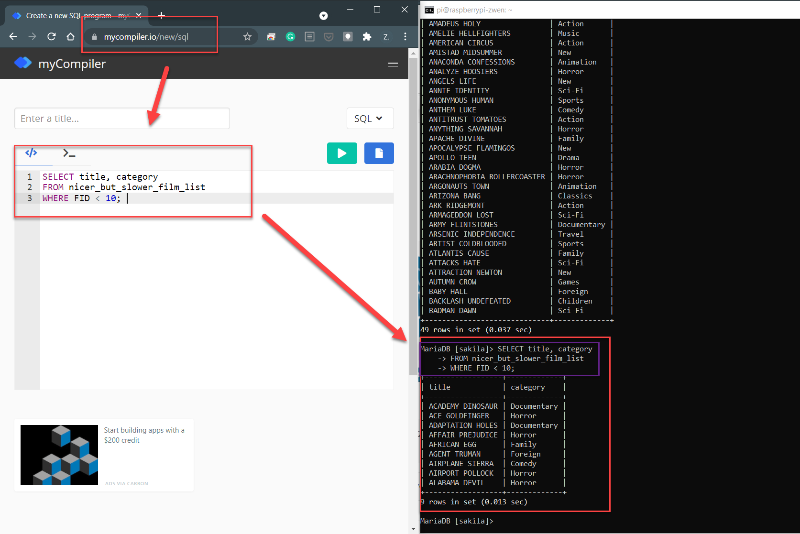

# 3.4 More SQL Exercises

In this exercise, we will be running many different queries using SQL to achieve a better understanding in working with database. 

When a potential query is long, you will find it helpful to write a query using the following tool below, then copy it to the MariaDB for execution. (Note: this is called the "workflow")

> URL of the Tool: [https://onecompiler.com/mysql](https://onecompiler.com/mysql)

Let's run queries to retrieve data to answer the following questions: 

* Q1. See the list of all tables. 
* Q2. See all the columns in `payment` table. 
* Q3. Customer city and file category association. 
* *more questions and examples of queries coming here...* Will delve into the following commands in greater detail: `SELECT`, `FROM`, `WHERE`, `GROUP BY`, `ORDER BY` 

