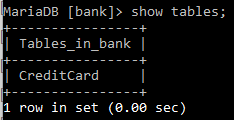
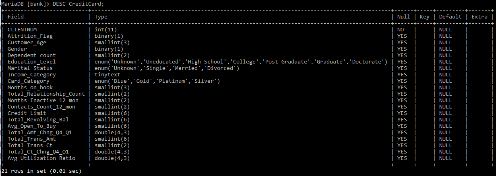
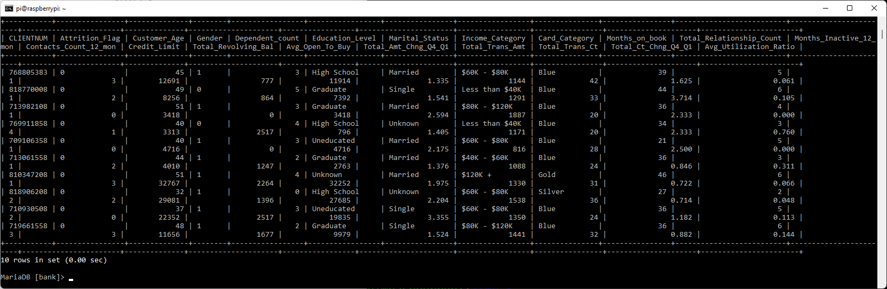
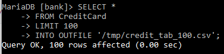
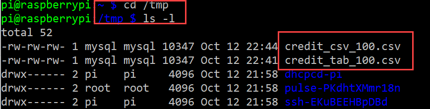
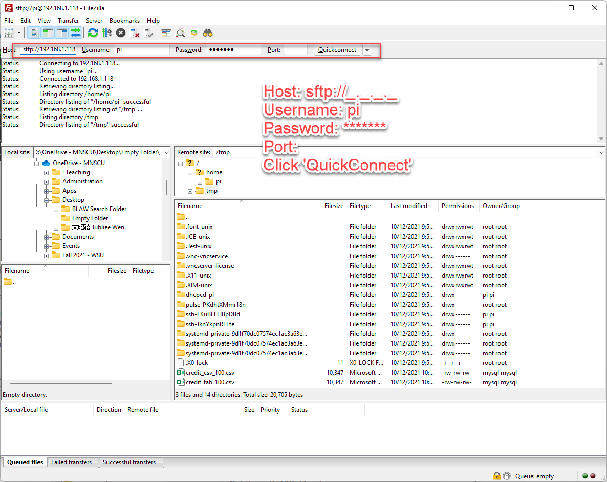
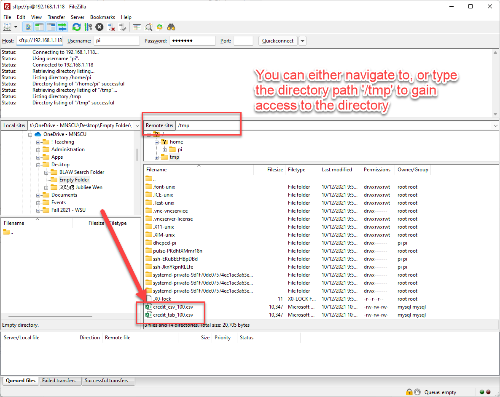
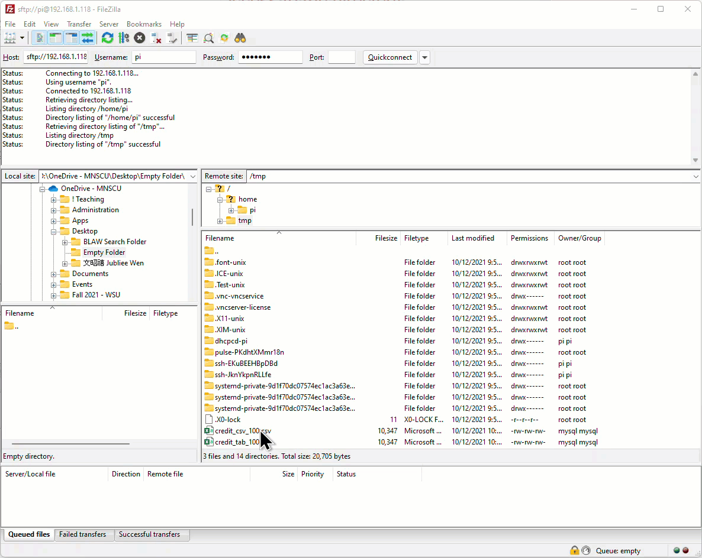

# 4.1 Exporting Data for Analytics - Part I

**:warning: In this instruction, you will be asked to import a new database called `bank` , which has only one table `CreditCard`. Then, we will start to see how data can be exported from a DBMS, and how to connect to the remote server to copy those files to the local computer for further analysis.** 


Before continue, please download the following tools. We will need to use those at some point in this instruction sets. 

**FileZilla** - Free for both Windows and macOS

> FileZilla: https://filezilla-project.org/download.php?type=client
>
> For macOS version, click: https://filezilla-project.org/download.php?platform=osx

**Advanced NotePad :** 

> NotePad++ (ONLY Available in Windows ): https://github.com/notepad-plus-plus/notepad-plus-plus/releases/download/v8.1.5/npp.8.1.5.Installer.x64.exe
>
> Sublime Text (Available for macOS): https://www.sublimetext.com/download


**Step 1.** Please use the following two terminal commands to import an existing database into your MariaDB. 

Download it to the current (ideally your Downloads directory) Raspberry Pi directory. 

```shell
wget http://www.compsaver.net/downloads/bank.sql
```

Import the database into your MariaDB by

```shell
mysql -u userName -p < bank.sql
```


**Step 2.** Let's get familiar with the `bank` Database. It has only one table called `CreditCard`,




It has many fields that can help us understand what kind of customer will likely to churn. The `Attrition_Flag` variable is the indicator (1 or 0) whether the customer is an existing customer or not. We can ask questions such as: 

* Whether the age is a factor in customer churning?  `Customer_Age` 
* Does specific card category deserve more attention? `Card_Category`
* Do customers engage more often less likely to leave? `Total_Relationship_Count` 
* Or is it a combination of multiple factors? 




We can also try to browser what does each record look like. Since the `CreditCard` table has 10127 records (or rows), let's just review first 10 records by using `LIMIT 10` clause. 

```mariadb
SELECT *
FROM CreditCard
LIMIT 10;
```



**Step 3.** Before using any conventional or modern analytic techniques, an analyst must obtain a structured data. To us, that means to export the data from the MariaDB so that the analyst can use the data for more advanced analysis. To do that, within the MariaDB, we can use the `INTO OUTFILE '/path/outfile'` clause. 

Since we are still experimenting with this process, let's first export 100 records to see how this process work. The complete dataset has more than 10,000 rows. 

```mariadb
SELECT *
FROM CreditCard
LIMIT 100
INTO OUTFILE '/tmp/credit_tab_100.csv';
```

If gone successfully, you will see, 




Before we move to the next step and start to understand what we did, let's export one more file with a slighted longer version of the command. Be mindful that the file name is different this time.  

```mariadb
SELECT *
FROM CreditCard
LIMIT 100
INTO OUTFILE '/tmp/credit_csv_100.csv'
    FIELDS TERMINATED BY ','
    LINES TERMINATED BY '\n';
```

Now, under the `/tmp` directory, you should be able to see the two files we just exported. 

(Note: I advanced to the `/tmp` directory with ` cd` command. Then listed all the files with additional details with `ls -l` command. )




**Step 4.** First, let's bring those files into our computer. Please open up `FileZilla` , to connect to your Raspberry Pi using a `SSH file transfer protocol` or `sftp` channel. You will need to use the same information you use to access your R-Pi through `SSH`. 





Your files are here!




You can drag both files to any folder in your computer (left-hand side is your computer folders). 




### Conclusion 

Before move on, please see if you understand the followings: 

- [ ] SQL clause to export database tables into files;
- [ ] SQL clause to limit the number of rows to display; 
- [ ] What does FileZilla do. 


