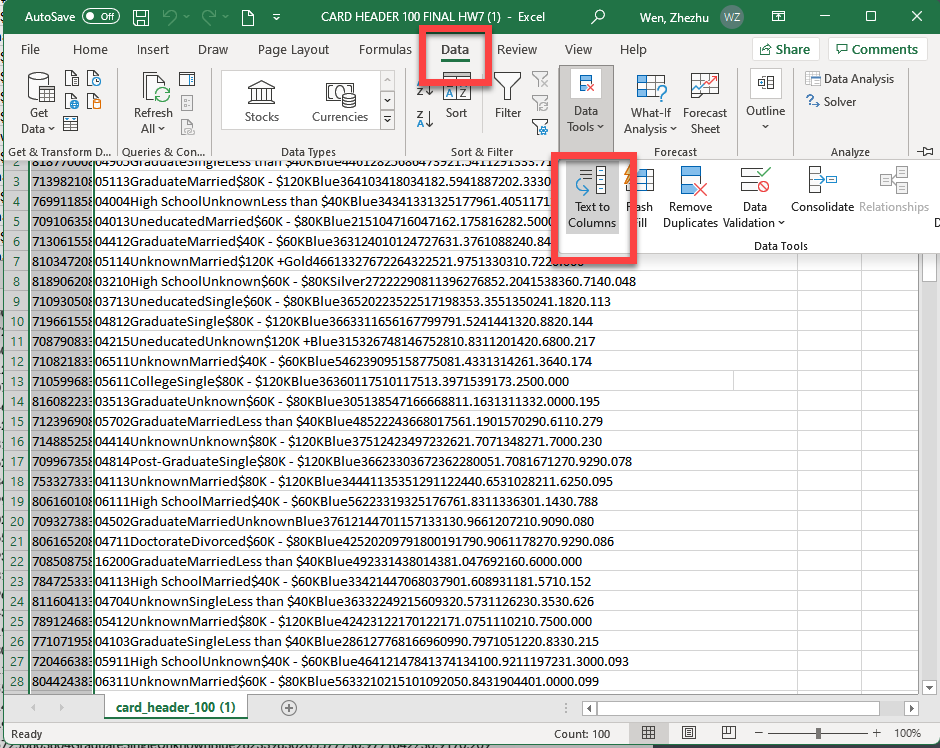
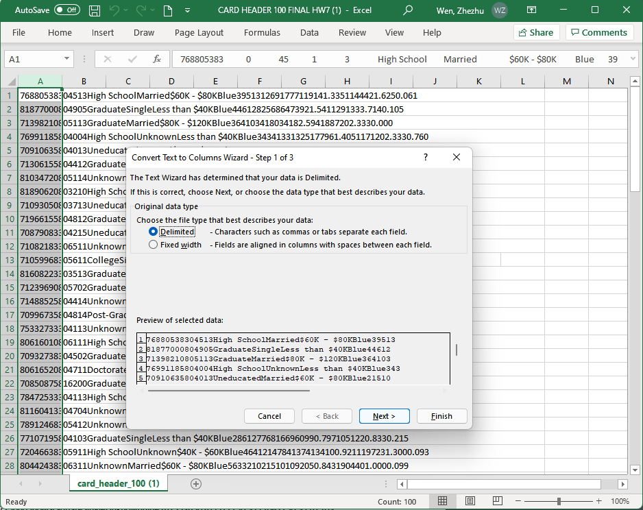
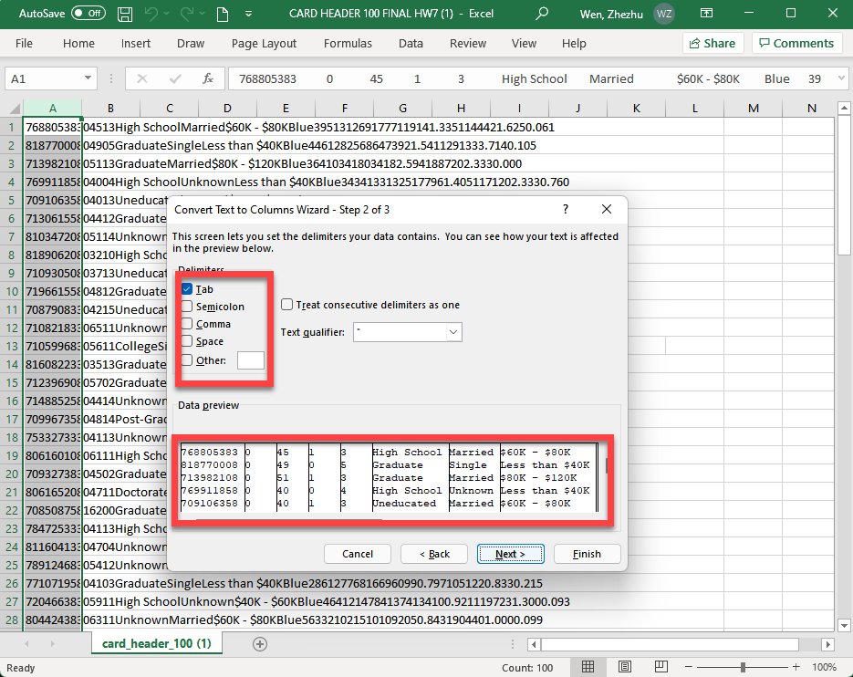

# 4.1.1 Data in its Naked Form

In this instruction, you will see how data are being organized with various separators. **Those are usually invisible to untrained eyes.** 

### 1. Opening the Files in Excel

Let's try to open the `credit_tab_100.csv` file. I believe this is what you will be seeing. 

The `credit_csv_100.csv` file will look much better. 

### 2. Opening the Files using Text Editor 

The tab separated file, after enable `show hidden all characters` option from `NotePad++`, will look like this in the background. You can see that all values are separated using `tab` and each line is concluded by `LF` or  line feed symbols. (Note: Line feed is an ASCII character or button on the printer that instructs the printer to move down one line.)

This is what the `CSV` or `comma separated values` file look like. All values are separated with `,` and each line is ended by `LF` symbol. 

### 3. Relying on Excel Data Import Wizard 

To display a Tab separated values or a `csv` file properly in Excel, we can rely on the powerful Data Import Wizard. It is under `Data` >>`From File` >>`From Text/CSV` . Please specify the file.  

Then, you will see the wizard can recognize the correct separator (or delimiter). Click `Load` to finish.  

### 4. Alternative Approach - Better Approach for macOS

Another approach to display messy looking tab-separated file is by using the `Text to Columns` tool in Excel. It is under the `Data` tab. 

Select `Delimited` mode in the following screen. 

Since we are working with a `Tab` separated values, we will use `Tab` as the delimiters (or the separaters). As you switch between different delimiters, you will see the data in the `Data Preview` section look more organized. 

Note: The import process works much the same with a `CSV` file. 

