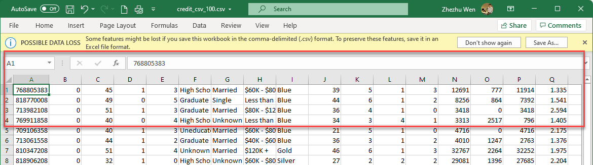

# 4.2 Exporting Data for Analytics - Part 2

**:warning: In this instruction, we will continue to work on the export we attempted in 4.1. There are a couple of issues we need to address in order to export the original data to suit the needs of analysis.** 


Even though now we know 1) how to export data from MariaDB, and 2) how to open it properly in an Excel, it is still not adequate. **Can you see why?** 

Since the file does not have a column name, it really cannot be analyzed properly. 




To export a data with a correct column name, we need to use the following SQL command. Basically, the command appends the data below the column name provided in the first line. 

```mariadb
SELECT 'ColName1', 'ColName2', 'ColName3'
UNION ALL
SELECT ColName1, ColName2, ColName3
    FROM YourTable
    INTO OUTFILE '/path/outfile'
```

How to use this structure in our context? 

Here are the commands. Again, I am exporting two separate files. **One with only first 100 records,** 

```mariadb
SELECT 'CLIENTNUM', 'Attrition_Flag', 'Customer_Age', 'Gender', 'Dependent_count', 'Education_Level', 'Marital_Status', 'Income_Category', 'Card_Category', 'Months_on_book', 'Total_Relationship_Count', 'Months_Inactive_12_mon', 'Contacts_Count_12_mon', 'Credit_Limit', 'Total_Revolving_Bal', 'Avg_Open_To_Buy', 'Total_Amt_Chng_Q4_Q1', 'Total_Trans_Amt', 'Total_Trans_Ct', 'Total_Ct_Chng_Q4_Q1', 'Avg_Utilization_Ratio'
UNION ALL
SELECT *
FROM CreditCard
LIMIT 100
INTO OUTFILE '/tmp/card_header_100.csv'
FIELDS TERMINATED BY ','
LINES TERMINATED BY '\n';
```

and **the other with every record.** 

```mariadb
SELECT 'CLIENTNUM', 'Attrition_Flag', 'Customer_Age', 'Gender', 'Dependent_count', 'Education_Level', 'Marital_Status', 'Income_Category', 'Card_Category', 'Months_on_book', 'Total_Relationship_Count', 'Months_Inactive_12_mon', 'Contacts_Count_12_mon', 'Credit_Limit', 'Total_Revolving_Bal', 'Avg_Open_To_Buy', 'Total_Amt_Chng_Q4_Q1', 'Total_Trans_Amt', 'Total_Trans_Ct', 'Total_Ct_Chng_Q4_Q1', 'Avg_Utilization_Ratio'
UNION ALL
SELECT *
FROM CreditCard
INTO OUTFILE '/tmp/card_header.csv'
FIELDS TERMINATED BY ','
LINES TERMINATED BY '\n';
```

Can you bring those newly created files back to your computer for further analysis? 


**Note:** 

I would say the most valuable and productivity-saving part in this instruction is to obtain the column names. If you were to do it on your own, would you have typed it? Is there any better way to do this? 

```mariadb
'CLIENTNUM', 'Attrition_Flag', 'Customer_Age', 'Gender', 'Dependent_count', 'Education_Level', 'Marital_Status', 'Income_Category', 'Card_Category', 'Months_on_book', 'Total_Relationship_Count', 'Months_Inactive_12_mon', 'Contacts_Count_12_mon', 'Credit_Limit', 'Total_Revolving_Bal', 'Avg_Open_To_Buy', 'Total_Amt_Chng_Q4_Q1', 'Total_Trans_Amt', 'Total_Trans_Ct', 'Total_Ct_Chng_Q4_Q1', 'Avg_Utilization_Ratio'
```

