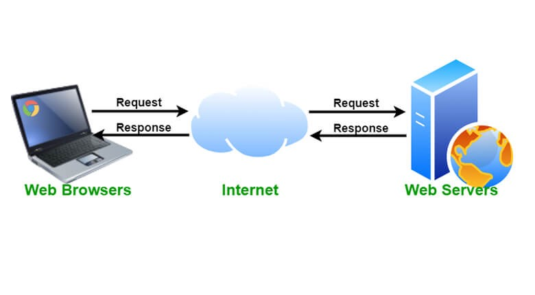

# 5.0 Setup Raspberry Pi as a Web Server

Since your Raspberry Pi is essentially a Linux system, it is capable to be configured as a web server. 

The Apache HTTP Server, colloquially called Apache, is a free and open-source cross-platform web server software, released under the terms of Apache License 2.0. As a Web server, Apache is responsible for accepting directory (HTTP) requests from Internet users and sending them their desired information in the form of files and Web pages. Much of the Web's software and code is designed to work along with Apache's features.

