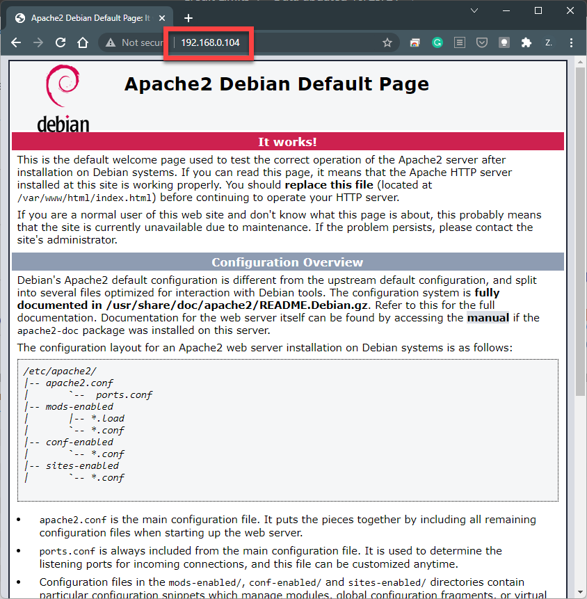

# 5.1 Setup Apache Server

:warning: This is part of the midterm exam. Most of you (if not everyone) should have already completed this. 

First, let's update the repository information. 

```shell
sudo apt update
```

Then, install the apache server package by typing the following command. 

```shell
sudo apt install apache2 -y
```

Lastly, verify the installation by visiting your Raspberry Pi IP address through your computer web browser. (For example, below, I typed the IP address of my Raspberry Pi in my Chrome from my laptop.) If you see the following page, it means the installation is successful. 


