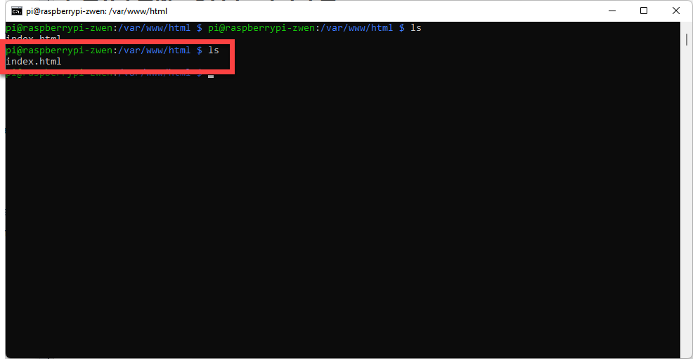

# 5.2 Understand Apache Root Directory

The Apache package will create a root directory of its own. Whatever contents you may be storing under the root directory, the contents can be accessible using the web browser. 

The folder is located in the following location:

```shell
/var/www/html/
```

Let's check what's inside by 

```shell
cd /var/www/html/
ls
```

or by

```shell
ls /var/www/html/
```

In my case, I only see an `index.html` file. 



Let's understand more about how does this directory is linked to the web service. 

Before we execute the following command, please make sure that you are currently within the root directory by 

```shell
pwd
```

If you can confirm that you are within the `/var/www/html/` directory, you can proceed by typing 

```shell
sudo wget https://www.winona.edu/Images/Apply-Free.jpg
```

If the file is downloaded successfully, you should be able to see the file from your Chrome browser by typing 

```
http://your.ip.address/Apply-Free.jpg
```


