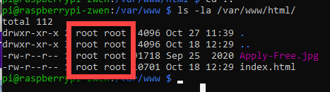
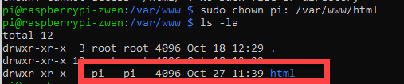

# 5.3 Setting Permission of the Root Directory

Linux system implements a rigorous permission system so that unauthorized users cannot execute anything beyond what's permitted.

For example, you can review the permission of the root directory by typing 

``` shell
ls -la /var/www/html/
```



Mine says both the root `html` directory and everything within the directory are owned by the `root` user. Remember that the `root` is the super admin who is essentially the owner of the system. No wonder why we had to active the super admin mode when we tried to download a file into the root directory. (If you check the permission of your own `Downloads` directory, you can see that the owner is `pi`, which is you. Therefore, we did not need to active the `sudo` when `wget` something into the directory. )

This can be problematic if we try to transfer many files at once using external tools such as `FileZilla`. Remember when we attempted to transfer file from Raspberry Pi using `FileZilla`, we logged in as `pi`. 

So it will be a good idea to take over the permission from `root`. We do that by, 

```shell
sudo chown pi: /var/www/html
```

As can be seen from the screenshot below, now the permission is moved to `pi`. 



Now you can move things freely into the directory using your favorite file transfer tools such as `FileZilla` by logging in as `pi`. 

