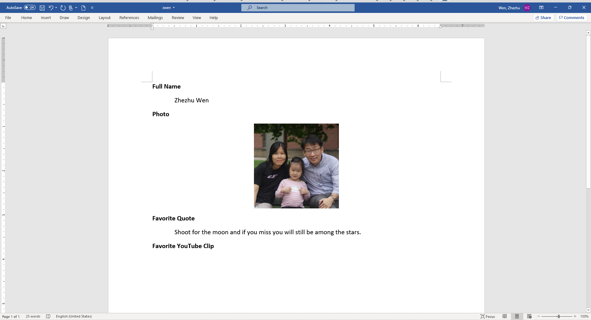
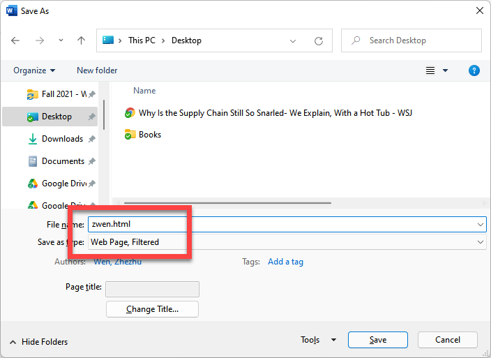
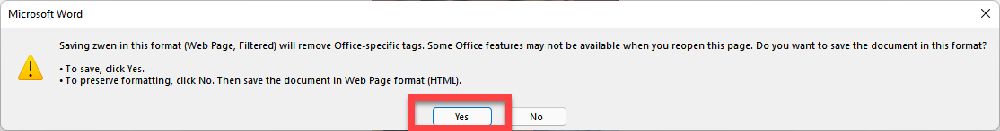
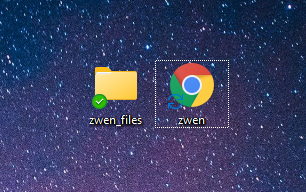
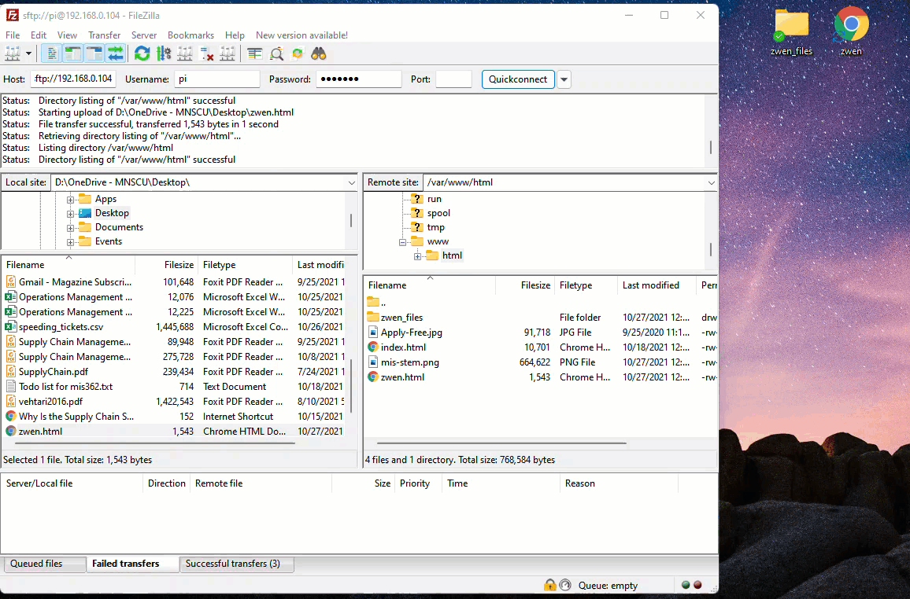
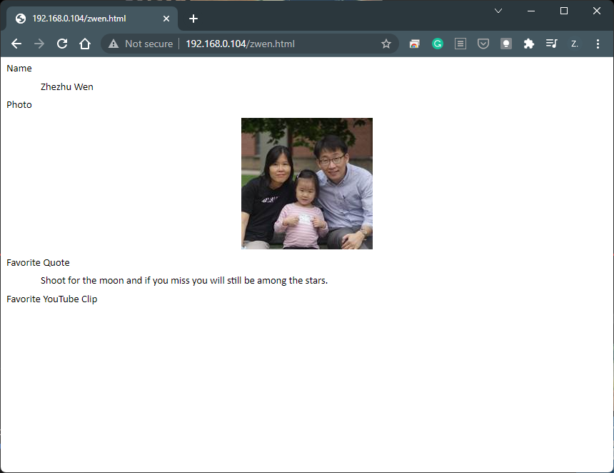

# 5.4 Host an Example Web Page

:warning: Lecture Recording for this part is available at https://web.microsoftstream.com/video/23827713-4f14-4b00-a4d4-51ca027b7faf?list=studio

Since we have a web server that is up and running, let's plan to host some web files there. Please make a simple self-introduction web page by following the steps below. 

First, Start a Word file, then complete the following contents with your own information. (Leave the "Favorite YouTube Clip" part out.)

Once done, please save it as `first initial last name.html` make sure to save as `Web Page, Filtered` file type. 

Click `Yes` if the warning pops up. 

You will see that, in addition to the file you intended to create, a folder will also be created. 

Move both file and the folder into the `/var/www/html/` directory in your Raspberry Pi using the `FileZilla`. 

Now you can visit your own creation by typing the URL in your web browser!

