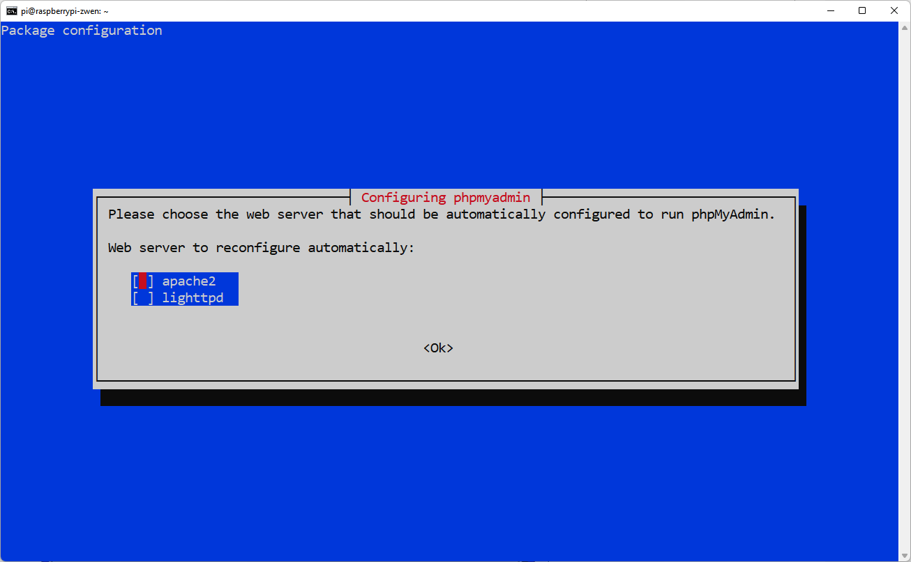
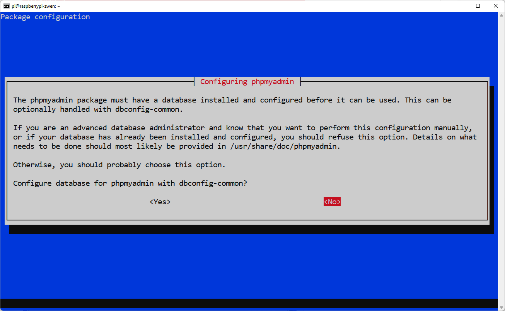
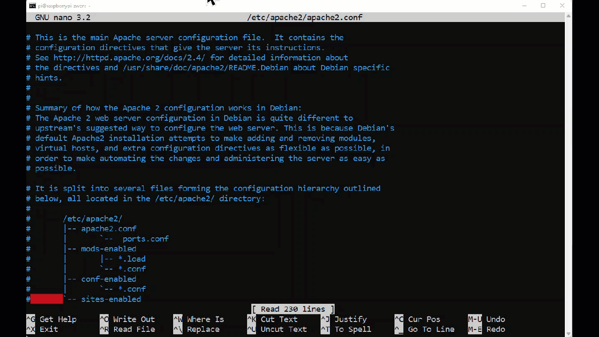
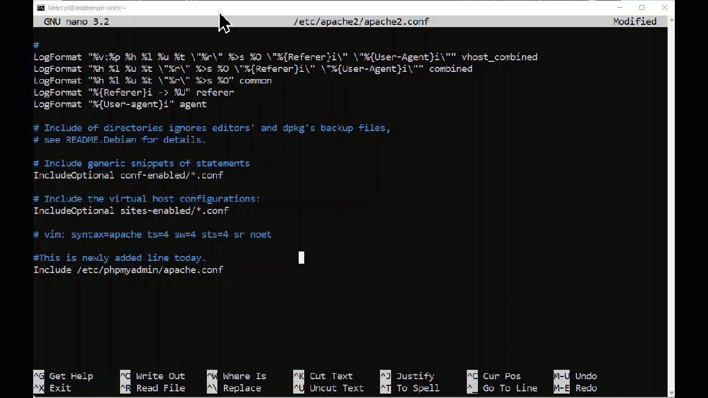
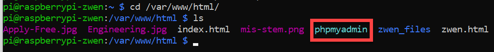
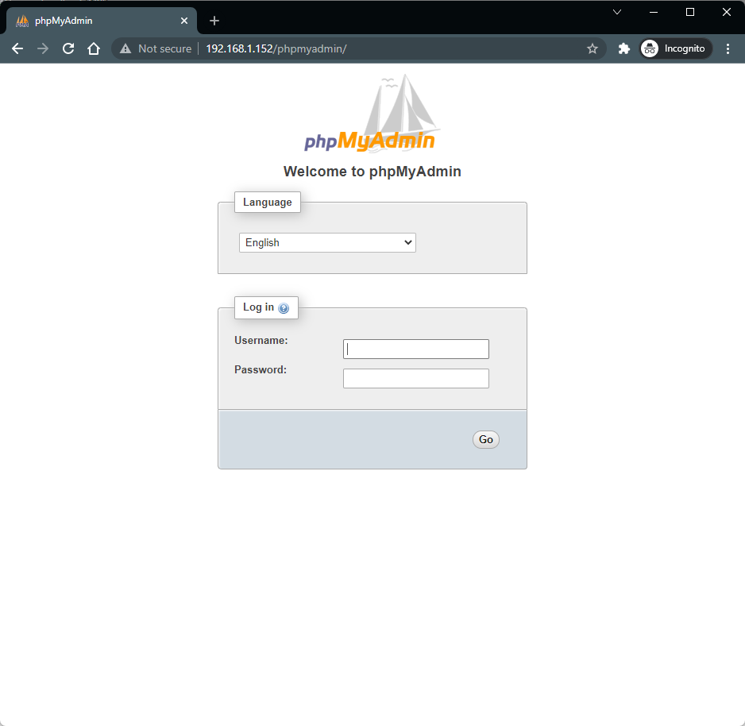
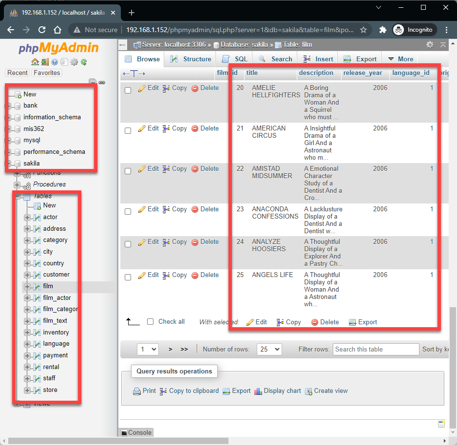

# 5.5 Install MariaDB Web Interface

So far, we have been interacting with MariaDB through terminal interface. There is a more intuitive way of navigating MariaDB through `phpmyadmin` web interface. In this instruction, we are going to install and enable the web service. 

:warning: In this instruction, you will be required to intervene some of the configuration processes manually. Therefore, please read the instructions carefully in each step. 

**Step 1.** Let's initiate the installation by typing the following two commands. 

```shell
sudo apt update
```

Once done, the following command will start the installation process. 

``` shell
sudo apt install phpmyadmin -y
```

**Step 2.** Intervention!!!! At some point, you will see this screen pops up. This is asking you which web hosting server is being used. Remember, we are using `apache`. Make sure the red selection box is in front of the `apache2`, then hit enter key to confirm. 




**Step 3. This step is crucial.**  Since the MariaDB is already installed and configured, you will need to choose `No` . By default, it is <Yes>, but you will need to use the keyboard arrow key to select `No`. Then, click `Enter` to confirm. 




## Two more steps left. Go take a break. Because it needs to be carefully done. 

**Step 4.** Type the following command to open a notepad app called `nano` to edit a configuration file in `/etc/apache2/apache2.conf` directory. 

```shell
sudo nano /etc/apache2/apache2.conf
```

Once it is opened, you will see the following screen. Repeatedly press the downward arrow key to reach the bottom of the file. (Note: your last line will be different than mine, because I am already done adding it.)




Add the following line at the bottom of the file, so that I will look like mine from the video (or gif) file above.

```tex
Include /etc/phpmyadmin/apache.conf
```

Once done, you save and exit by pressing `Ctrl + X` and then `Y` to confirm, then `Enter` to finalize. 




## Almost Done! One more step!

**Step 5.** Since we changed the core configuration file, the apache service needs to be restarted. 

```shell
sudo service apache2 restart
```

Then, finally execute this command. This will add a `phpmyadmin` directory link under `/var/www/html` directory. 

```shell
sudo ln -s /usr/share/phpmyadmin /var/www/html
```


## Confirm the Result Before Move on

It you go take a look what is the new addition under the `/var/www/html/` directory, you will see a new directory `phpmyadmin` is added. 



Then, let's visit the service by typing `http://your_raspberry_pi_ip/phpmyadmin` , you will see the following web interface. Try login with your MariaDB credentials. 



**Once you are in, you will see all the familiar database, tables, and records there. Please screenshot the screen and submit as the evidence of completion.** 


