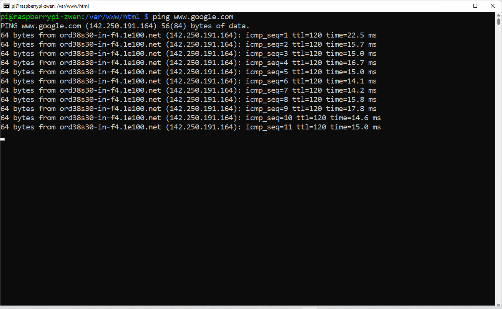
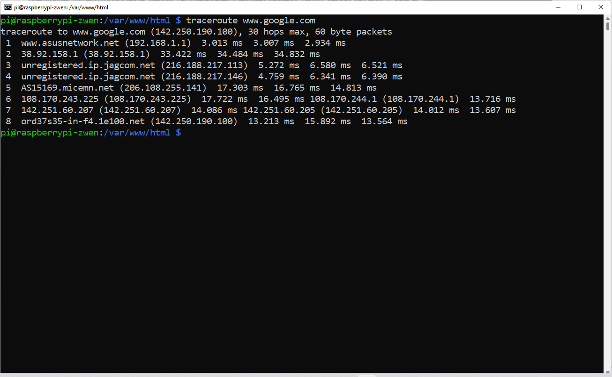
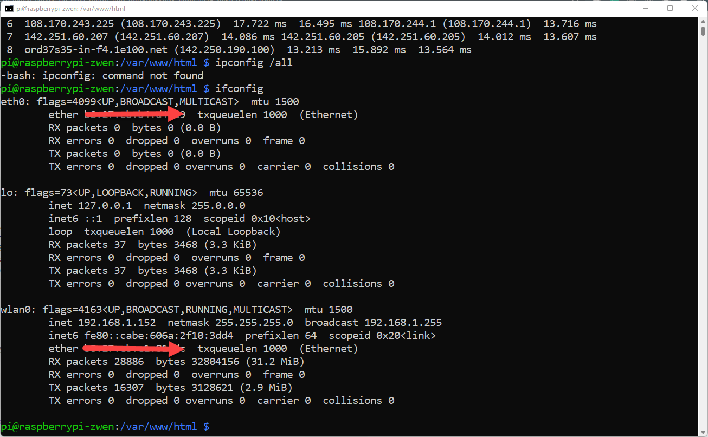

# 6.1 Basic Linux Terminal Command


### ICMP (Internet Message Protocol)

The Internet Control Message Protocol (ICMP) is a supporting protocol in the Internet protocol suite. It is used by network devices, including routers, to send error messages and operational information indicating success or failure when communicating with another IP address, for example, when an error is indicated when a requested service is not available or that a host or router could not be reached. (from Wikipedia.com)

To detect whether a target computer is reachable and also to see the response time, a `ping` command can be used. Let's try, 

```
ping www.google.com 

```

`ttl` means 'time to live'. It is essentially the number of hops the packet is allowed to have before it is being discard. 

The time is how fast you are getting response from the target computer. 



traceroute and tracert are computer network diagnostic commands for displaying possible routes (paths) and measuring transit delays of packets across an Internet Protocol (IP) network.

Try

``` shell
traceroute www.google.com 
```

it will display a list of hops it needs to get to the google web server. In place `www.google.com`, you can use any IP address you plan to review the route. 




### Other Commands 

To see the IP address

```shell
hostname -I
```

To see all the network interfaces and their associated MAC addresses,

```shell
ifconfig
```

I am using arrows to cover my own MAC addresses. You should see yours. In here, you can see that my Raspberry Pi have two network interfaces: `eth0` is my ethernet port, and `wlan0` is the Wi-Fi network. 



