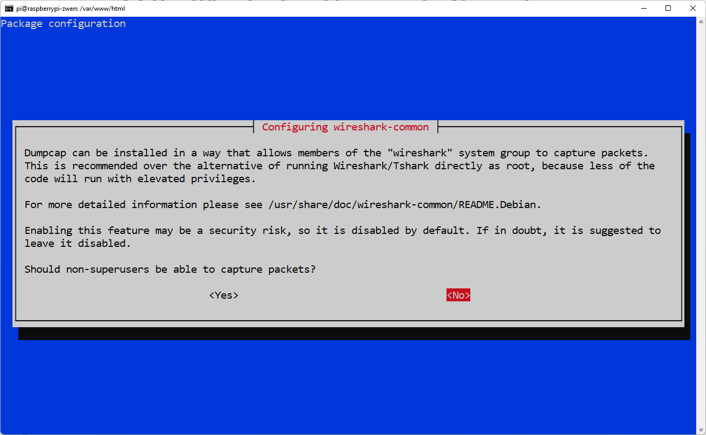
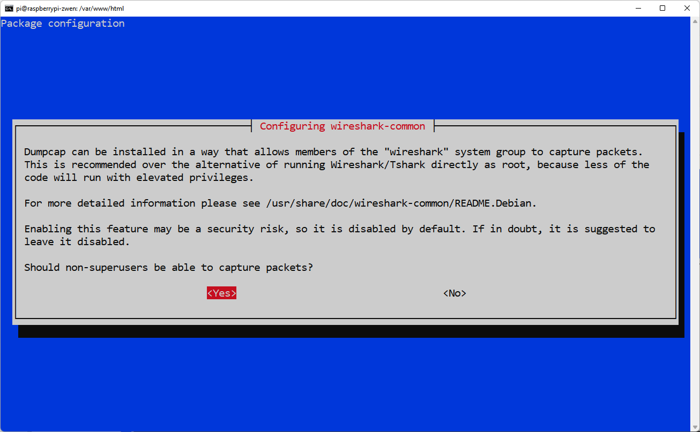
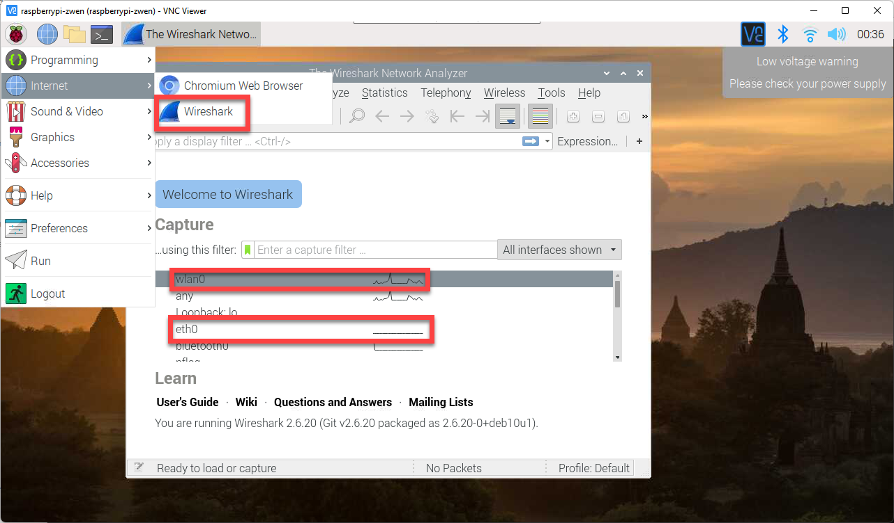

# 6.2 Use Wireshark to Listen to the Network


"Wireshark is the world’s foremost and widely-used network protocol analyzer. It lets you see what’s happening on your network at a microscopic level and is the de facto (and often de jure) standard across many commercial and non-profit enterprises, government agencies, and educational institutions. " (from its website)

First, let's update the app repository, so that the installer won't encounter any missing package warning/problems. 

```shell
sudo apt update
```

Install the Wireshark package. 

```shell
sudo apt install wireshark -y
```


When you see this message, please choose `no`. 



Once done, please execute the following command. 

```shell
sudo dpkg-reconfigure wireshark-common
```

This time, choose `Yes`. 



Change up some user settings by executing 

```shell
sudo usermod -a -G wireshark $USER
```


Then, reboot your raspberry pi by 

```shell
sudo reboot
```


`Wireshark` needs to operate under a graphical user interface. Therefore, please access to your Raspberry Pi from VNC viewer. Under the `Internet` app category, you will see that `Wireshark` is already installed. Click to open it. 

Your Raspberry Pi has two network interfaces: `wlan0` and `eth0`. Wireshark is capable of listening to communications happening in all your network interfaces. What is the evidence that the `Wireshark` is listening? If you can see that the `Wireshark` has "pulse" on any of the current network interface you have connected to (note: I am currently connected via Wi-Fi, therefore `wlan0` has pulse), then it means that it is currently picking up something from that network interface. We will discuss specific usage in-class. 

