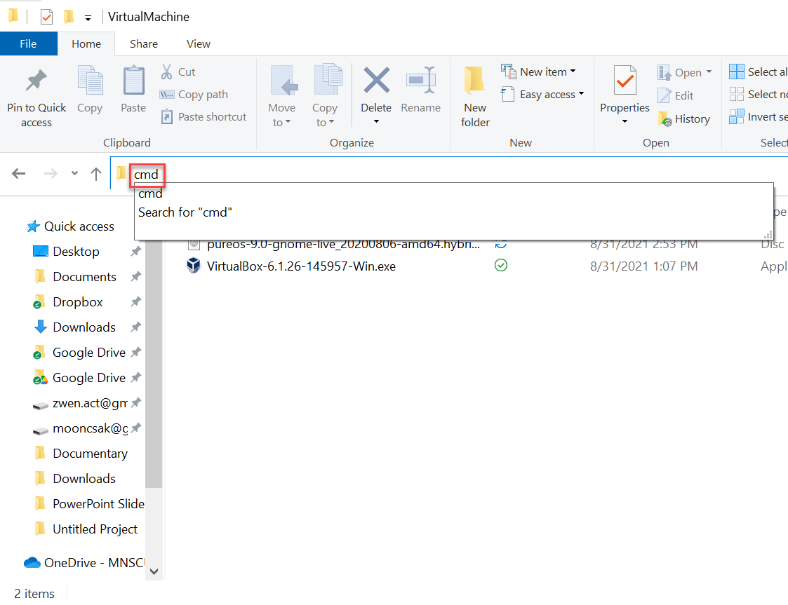

## Install Pure OS on VirtualBox

### Step 1. Download VirtualBox & Pure OS

#### 1.1 Download VirtualBox

Go to the following URL and download a VirtualBox software. 

[Windows ](https://download.virtualbox.org/virtualbox/6.1.26/VirtualBox-6.1.26-145957-Win.exe)

#### Download Pure OS

#### (Optional) Verify Both Files

We can verify whether we have downloaded the files we intended to download by checking the hash values against what is provided by the author. In other words, we should be able to re-produce the hash value on our end. 

**Step 1. **Using the file explorer, go to the folder where the files are downloaded (or saved). And type `cmd` in the address bar. Then, hit the `Enter` key. 

**Step 2.**  Use the `dir` command to list all the files in the folder. Please visually confirm whether the target files are in the list. `dir` means "show what is in the directory."

**Step 3. **Use the following command to generate the hash value. 

`CertUtil -hashfile file_name SHA256` 

Use the target file name in place of "file_name" in the command above. `SHA256` is the algorithm that is being used to generate the hash value in this case. There are other types of hash algorithms, for example, `MD5`, `SHA1`, `SHA128`, `SHA512`, etc. 

# Step 2. Install VirtualBox

### Step 3. Create a Virtual Machine in VirtualBox

### Step 4. Install Pure OS in the Virtual Machine
