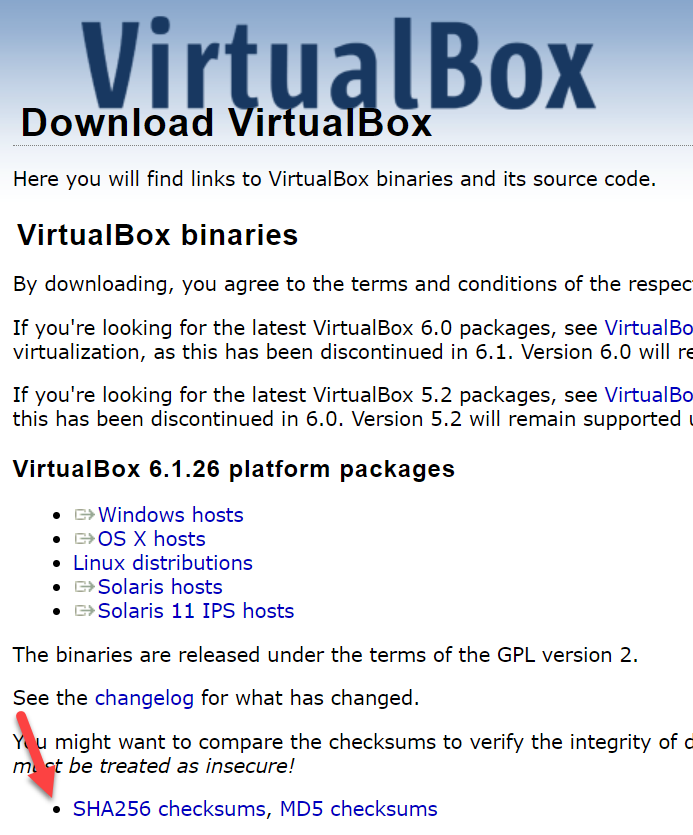
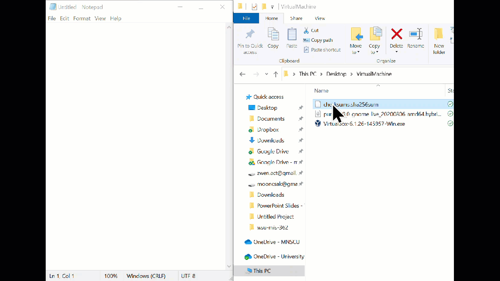

### Download VirtualBox & Pure OS

#### 1.1 Download VirtualBox

Go to the following URL and download a VirtualBox software. [https://www.virtualbox.org/wiki/Downloads](https://www.virtualbox.org/wiki/Downloads)

Please download based on the type of computer you are using. For example, macOS users should download "OS X hosts" option.

#### 1.2 Download Pure OS

Next, go to the following URL to download Pure OS. Download the "Stable" version. There is no macOS and Windows distinction for this download. 

[https://pureos.net/download/](https://pureos.net/download/)

#### 1.3 (Advanced) Obtain SHA256 Information

Notice that both download websites provide `SHA256 checksums` or `SHA256SUM` . Those are long strings of text that seem have no meaning. But those are important for the security reasons. We can verify whether we have downloaded the files we intended to download by checking the hash values against what is provided by the author. In other words, we should be able to re-produce the hash value on our end. 

For `VirtualBox` software, you can see the SHA256 through the link below. The web page will contain a list hash values for all the downloadable files. You must find out the one that matches with your file. Copy the value somewhere else. 

For `Pure OS`, the `SHA256` is provided through a file which can only be opened using a NotePad.  

Once the file is download, then drop the file into the NotePad program. 

*Before proceed, make sure all SHA256 values are identified.* In my case, SHA256 for VirtualBox is 

`eed44e66d898c17cae46a14dff1fc86ac5c321372a7fc46efcef454c1e454307 `

That for Pure OS is 

`041466fba2e1b7cfca576d003e9553490d541653d84d29dfb5adba957fffe88e` 

#### 1.4 Generate Hash Values for Each File

**Step 1. **Using the file explorer, go to the folder where the files are downloaded (or saved). And type `cmd` in the address bar. Then, hit the `Enter` key. 

**Step 2.**  Use the `dir` command to list all the files in the folder. Please visually confirm whether the target files are in the list. `dir` means "show what is in the directory."

**Step 3.** Use the following command to generate the hash value. 

`CertUtil -hashfile file_name SHA256` 

Use the target file name in place of "file_name" in the command above. `SHA256` is the algorithm that is being used to generate the hash value in this case. There are other types of hash algorithms, for example, `MD5`, `SHA1`, `SHA128`, `SHA512`, etc. 

