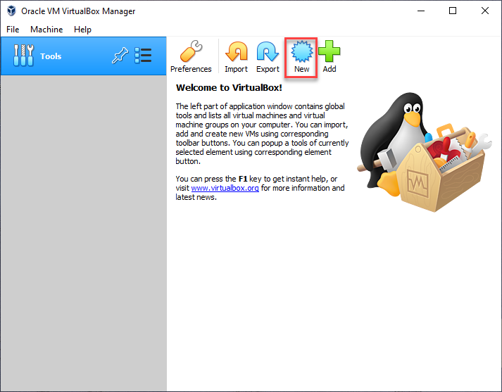
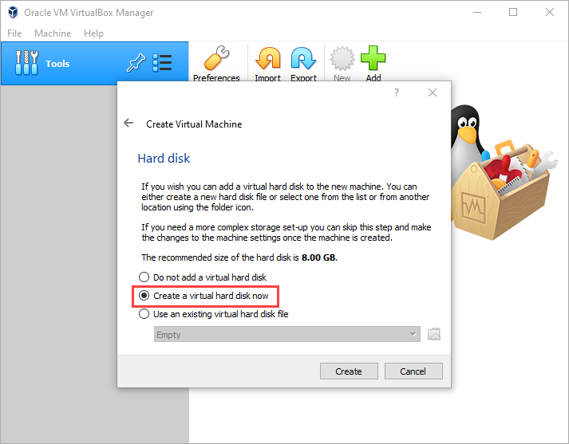
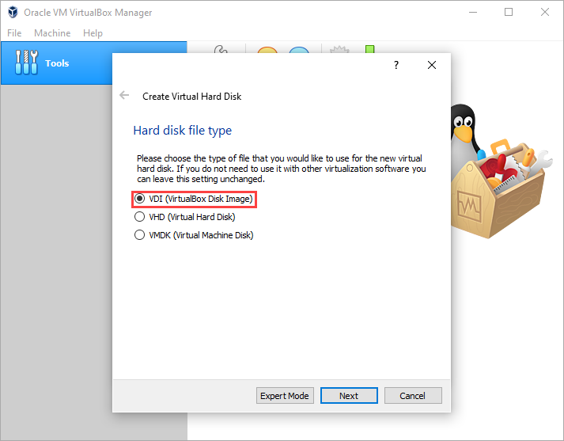
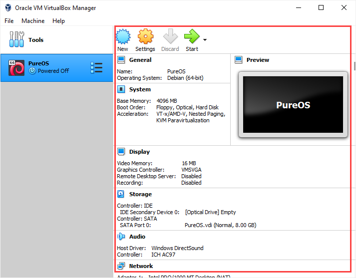

# Install and Configure VirtualBox Software on a Windows System

## Installation of VirtualBox

Step 1. Double click the installation file - `VirtualBox-version-number-Win.exe`  (Note: In the file name, `.exe` is called file extension. It tells user what type of file it is. `exe` means it is an executable file. You maybe thinking, all files I have been clicking "executes" a program? But that is not true. When you click a file, the operating system automatically launches the default program, usually an executable file, that can open the type of file. ) You will be greeted by the following screen. Click next. 

Step 2. The configuration process started. Please leave everything as/is in the following screen. 

Step 3. You may freely choose whether to select the second and the third options, but better leave the first and the last options selected. 

Step 4. Click Yes. There is nothing you and I can do here. Then, click through the rest of the processes, until you encounter a prompt. 

Step 5. Click `Install` to proceed. This will be the only prompt you will be encountering during the installation. 

Step 6. After the installation, if you open the program by clicking the icon, the following screen will show up. If you see this, congratulations!

## Create Your First Virtual Machine 

Step 1. Click `New`  to create your first ever virtual machine using VirtualBox software. 

Step 2. Your virtual machine will be saved as a file. Give it a proper name, specify the storage location. For the `Type` option, select `Linux`, and for the version, select `Debian (64-bit)` . Please double check the last two options. 

Step 3. You can specify the memory size of the virtual machine. You can choose whatever amount you like. But it needs to be bigger than `3072 MB` and within the green bar. Why bigger than `3072 MB`? That is the minimum memory requirement according to the [PureOS website.](https://tracker.pureos.net/w/pureos/hardware_requirements/) Why stay within the green range? Because you are creating a virtual computer within your actual computer. Therefore, you should never expect that the (virtual) computer within your (actual) computer can have a better performance. If you are on a WSU-lease laptop, `4096 MB` can be a good choice. 

Step 4. This virtual computer also needs a virtual hard disk storage space. Select the second option. 

Step 5. Let's stay with the suggestion for this one. Your virtual hard disk file will have an extension with `.vdi` 

Step 6. This is about the resulting file size of the `.vdi` file. The first option will be dynamically adjust the size of the file, while the second option will try to create a big file from the beginning. 

Step 7. I am using the following setting. The hardware requirement says the space needs to be at least `15 GB`. But since we are only going to use it briefly, if your computer is running out of space, please use as little as `8GB` . Then click `Create`. 

Step 8. You can scroll down the following screen to review the information about the (virtual) computer you have created inside of your (actual) computer. 

Step 9. Let's give the virtual machine a little more display power. Click `Setting`, in the following dialog box, go to `Display` section, increase video memory to `128MB`. Click `OK` to confirm. 

Step 10. Let's turn on the computer by clicking the `Start` icon! It will take some time for the computer to "boot up". Please watch the following video for a brief introduction of the environment. 

https://youtu.be/L_8bhRZjrUs
